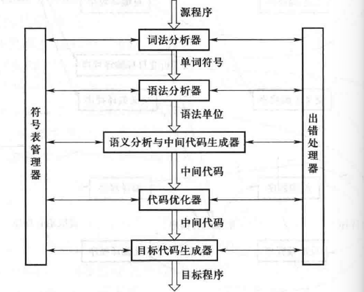
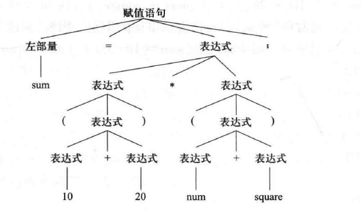

## 前言
**♥本章属于学习笔记，不一定具有参考价值，或请酌情阅读（估计也没人看）♥**

### 编译

源代码 -> 编译程序 -> 目标代码 -> 运行系统）（载入数据(input data)） -> 计算结果

### 编译系统的总体结构

1. 词法分析（扫描）
   识别各个单词（关键字、标识符...）-> 确定单词类型 -> 转化为同一机内表示

   词法单元形式：``token<种别码，属性值>``

   

2. 语法分析（语法分析器((Syntax Analyzer)/parser)）
   从词法分析器中输出的token中识别出各类短语，并编译出语句。（赋值语句分析树(中间代码)）
   
   

   1. 组合成句
   2. 分析树
   3. 指出错误

   4. 输入token
   5. 输出语句

3. 语义分析
   (semantic analysis) -> 语法制导翻译 (可同时与语法分析进行)

   分析右语法分析器识别出来的语法成分的语义。 （由语句语义 -> 影响语法分析）

   1. 获取标识符属于
   2. 语义检查
   3. 子程序静态绑定
   4. 变量静态绑定

4. 中间代码
   编译系统内部表示形式 (语义分析过程中产生)
   1. 容易生成
   2. 容易编译成目标代码  

5. 代码优化

6. 目标代码
   中间代码 -> 机械指令代码/汇编代码

7. 表格管理
   管理各种符号表 
8. 符号表管理
