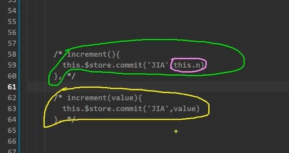
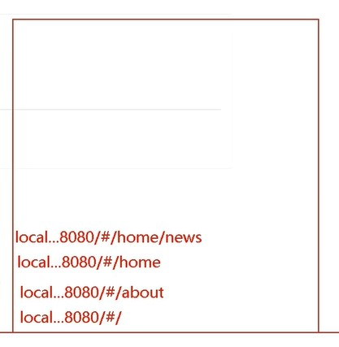

# 2. Vue组件

<!-- TOC -->

- [2. Vue组件](#2-vue组件)
  - [2.1. 组件的定义](#21-组件的定义)
  - [2.2. 非单文件组件](#22-非单文件组件)
    - [基本使用](#基本使用)
    - [几个注意点](#几个注意点)
    - [VueComponent](#vuecomponent)
    - [一个重要的内置关系](#一个重要的内置关系)
  - [2.2. 单文件组件](#22-单文件组件)
    - [初识单文件组件](#初识单文件组件)
    - [脚手架(CLI:command line interface)](#脚手架clicommand-line-interface)
    - [render()函数](#render函数)
    - [vue.config.js配置文件、](#vueconfigjs配置文件)
    - [Vue：.$refs属性](#vuerefs属性)
    - [props配置项](#props配置项)
    - [mixin(混入)](#mixin混入)
    - [插件](#插件)
    - [scoped](#scoped)
    - [注](#注)
  - [2.3. Todo-List](#23-todo-list)
  - [2.4. 组件自定义事件](#24-组件自定义事件)
    - [绑定](#绑定)
    - [解绑](#解绑)
    - [注意事项](#注意事项)
  - [2.5. 全局事件总线](#25-全局事件总线)
    - [TodoList\_v1.3简述](#todolist_v13简述)
  - [2.6. 消息订阅与发布](#26-消息订阅与发布)
    - [使用：](#使用)
    - [Todolist\_v1.4](#todolist_v14)
  - [2.7. 编辑功能\_Todo-list\_v1.5](#27-编辑功能_todo-list_v15)
    - [编辑功能](#编辑功能)
  - [2.8. vue与动画](#28-vue与动画)
    - [动画\&transition标签](#动画transition标签)
    - [过渡](#过渡)
    - [多个元素的过渡](#多个元素的过渡)
    - [animate.css](#animatecss)
    - [Todo-list\_v1.6](#todo-list_v16)
  - [2.9. vue脚手架配置代理](#29-vue脚手架配置代理)
  - [2.10. github搜索案例](#210-github搜索案例)
  - [2.11. 插槽](#211-插槽)
    - [默认插槽](#默认插槽)
    - [具名插槽](#具名插槽)
    - [作用域插槽](#作用域插槽)
  - [2.12. Vuex](#212-vuex)
    - [vuex--概念](#vuex--概念)
    - [vuex原理图](#vuex原理图)
    - [搭建Vuex环境](#搭建vuex环境)
    - [求和案例](#求和案例)
    - [求和案例优化](#求和案例优化)
    - [多组件数据贡献](#多组件数据贡献)
    - [vuex模块化\&namespaced（命名空间）](#vuex模块化namespaced命名空间)
  - [2.13. 路由](#213-路由)
    - [vue-router](#vue-router)
    - [SPA：](#spa)
    - [路由](#路由)
      - [后端路由](#后端路由)
      - [前端路由：](#前端路由)
    - [基本使用](#基本使用-1)
    - [注意点](#注意点)
    - [多级嵌套](#多级嵌套)
    - [query参数传递](#query参数传递)
    - [命名路由](#命名路由)
    - [路由params参数传递](#路由params参数传递)
    - [路由props配置](#路由props配置)
    - [router-link\&replace/push属性](#router-linkreplacepush属性)
    - [编程式路由](#编程式路由)
    - [缓存路由组件](#缓存路由组件)
    - [路由守卫](#路由守卫)
      - [全局前置\&全局后置](#全局前置全局后置)
      - [独享路由守卫](#独享路由守卫)
      - [组件内路由守卫](#组件内路由守卫)
    - [history和hash](#history和hash)
  - [2.14 打包](#214-打包)
  - [2.15 Vue UI组件库](#215-vue-ui组件库)

<!-- /TOC -->

## 2.1. 组件的定义

``实现局部(特定)功能效果的代码集合，是可复用的Vue实例``

1. 代码复用率
2. 简化代码
3. 深拷贝

```javascript
1. 非单文件组件：一个文件包含n个组件
2. 单文件组件：···
```

注：
模块:向外提供特定功能的js程序

## 2.2. 非单文件组件

### [基本使用](18非单文件组件/01基本使用.html)

```javascript
  1. 创建组件:
  Vue.extend({options})
  注:
  (i) el不写:因为最终所有组件都要被一个vm管理,由vm决定服务于哪个容器
  (ii) data浅拷贝,必须写成函数式
  2. 注册组件
  (i)局部注册:components:{}
  (ii)全局注册:Vue.component('组件名',组件)
  3. 使用组件
  template:`...`
  <组件名></组件名>
```

### [几个注意点](18非单文件组件/02几个注意点.html)

```javascript
  1. 组件名：
  （i）一个单词组成时：首字母小写，首字母大写
  （ii）多个单词组成：（kebab-case）：my-school/(CamelCase):MySchool（需要Vue脚手架）
  注：
  （i）回避HTML预留标签
  （ii）name:指定配置组件在开发者工具中显示的名字
  2. 关于组件标签：
  （i）<school></school>
  （ii）<school/>如果不在脚手架里，不能连续使用闭合时标签，否则将不能渲染
  3. 简写形式：
  const school=Vue.extend({})-> const school = {}
```

### [VueComponent](18非单文件组件/04VueComponet.html)

```javascript
school组件:
  1. 本质是一个名为VueComponent的构造函数，且不是程序员定义的，是Vue.extend()生成的
  2. 写<school/>或<school></school>时，Vue解析时会通过调用Vue中的school组件的构造函数生成实例对象。
  即Vue帮我们执行：new VueComponent(options)
  3. 每次调用Vue.extend()，返回全新的VueComponent（地址不同）
  底层Vue.extend()函数，直接返回一个构造函数
  4. this:
  （1）组件配置中：
  data、watch、methods、computed的函数实例对象的this均是[VueComponent实例对象（vc）]
  （2）.new Vue(options)配置中则是[Vue实例对象（vm）]
```


``vm和vc在代码层面上几乎无差，vc所拥有的功能vm都有，vm有的vc不一定有。vm的组件vc在vm对象中的children属性里``


### [一个重要的内置关系](18非单文件组件/05一个重要的内置关系.html)

```javascript
1. 一个重要的内置关系：VueComponent.prototype.__proto__===Vue.prototype
2. 目的：让组件(vc)也可以访问到Vue原型上的属性
```


注：

1. prototype被叫为显式原型，是函数所拥有的，指向构造它的对象本身，
2. __proto__被叫为隐式原型，是对象实例所具有的，指向其构造函数所具的prototype的对象

## 2.2. 单文件组件

### 初识单文件组件

``[文件].vue结构``:

```javascript
<template>
/* 组件结构 */
</template>

<script>
  /* 组件交互相关代码 */
</script>

<style>
  /* 组件的样式 */
</style>
```

``单文件组件的基框架:``

```javascript
1. [组件文件].vue：提供功能的组件
2. App.vue: 汇总所有功能组件的组件
3. main.js: 与App相交合，向尤其提供可用的js脚本
4. [index].html：与main.js向交合的容器。
```

### 脚手架(CLI:command line interface)

**定义**：Vue提供的标准开发平台（目前最新版本：4.x）

**安装**：``node.js -> npm -> npm install @vue/cli``

**创建**：``vue create [projectName] -> "select options" -> npm run serve ``

**cli文件分析**：

```javascript
public/index.html:
应用界面（单页面）

babel.config.js

package.json:应用包配置文件
1. "serve":构建服务器
2. "build":最后一次编译：编译成浏览器可识别的文件
3. "link":语法检查
package-lock.json：包版本控制文件

src/asset：
存放静态资源
src/components:
存放组件
src/App.vue:汇总所有组件
src/main.js:入口文件

```

### render()函数

```javascript
main.js:

import Vue from 'vue'
import App from './App.vue'
Vue.config.productionTip = false
new Vue({
  el:'#app',
  template:'<App/>',
  components:{App},
})

会编译运行不了。
因为vue缺少模板解析器。
es6修改了导入Vue文件的路径
```

解决方式：

```javascript
使用 render(createElement);
createElement：创建元素函数：
import Vue from 'vue'
import App from './App.vue'

Vue.config.productionTip = false
new Vue({
  el:'#app',
  // render: h => h(App),
 
  // render(createElement){
  //   //创建元素函数
  //   console.log(typeof createElement)
  //   return createElement('h1','我永远喜欢甘雨')
  // }
  
  // render:q=>q('h1','我永远喜欢甘雨'),

  render:h=>h(App),
})

```

综上：

```javascript
关于不同版本的Vue：
1. vue.js与vue.runtime.xxx.js：
（1）vue.js是完整版的Vue，包含：核心功能+模板解析器。
（2）vue.runtime.xxx.js是运行版的Vue，只包含：核心功能，没有模板解析器
2. 因为vue.runtime.xxx.js无模板解析器，所以不能使用template配置项，
   需要使用render函数接收到的createElement函数去指定具体内容。
3. 在.vue文件中<template></template>，有文件专门去解析
```

### vue.config.js配置文件、

1. vue inspect->output.js可以查看到Vue脚手架的默认配置。
2. vue.config.js可以对脚手架进行个性化定制。详见：[官网](http://cli.vuejs.org/zh)

### [Vue：.$refs属性](19单文件组件/01_组件&refs属性/App.vue)

1. 被用来给元素或`子组件`注册引用信息(id的代替者)；

   ```javascript
   或者代替元素js的document.getElementByid('...')
   ```

2. 应用在html标签上获取的是真实DOM元素，应用组件上则是组件实例对象vc

3. 使用

 ```javascript
标记： <... ref='...'></...>
获取：this.$refs.xxx
 ```

### props配置项

**props**：使组件接收传过来的数据

1. 传入数据：

   静态绑定：``<demo name='xxx'/>``

   动态绑定：``<demo :name='xxx'/>``

2. 接收数据：

   ```javascript
   (i) props:[...]
   
   (ii) props:{...:Number,...}
   
   (iii)props:{
    ...:{
      ...
    }
   }
   ```

3. props是只读类型，Vue不建议主动修改props中的数据，可复制一份在data上进行响应式操作

### mixin(混入)

功能：可以把多个组件共用的配置提取成一个混入对象。

```javascript
1. 定义混合：
export const EgMixin={
  data(){...},
  methods(){...}
}
2. 使用混合：
（i）全局混合：
 import {...} from 'minix'
 Vue.minin(...)
 (ii)局部混合：
 import{...} from '../minix'
 mixins:[...]
```

### 插件

```javascript
功能:用于增强Vue
本质：包含install方法上的一个对象,封装了许多全局的方法和功能可供使用。
第一个参数为Vue，后为传入插件的参数。
定义：
[对象].install=function(Vue,options){
    1.添加过滤器
    Vue.filter(...)
    2.添加全局指令
    Vue.directinve()
    3.配置全局混入
    Vue.mixin(...)
    4.添加实例方法：
    Vue.prototype.$myMethod=function(){...}
    Vue.prototype.$myProperty=xxxx
}
使用：Vue.use()
```

### scoped

   作用：让样式在局部生效，防止冲突：``<style scoped>``

### 注

1. 前置知识：ES6模块化
2. [脚手架官方文档](https://cli.vuejs.org/zh/)
3. bebal:ES6=>ES5

## 2.3. Todo-List

  1. 组件化编码流程：
     （1）拆分静态组件：按照功能拆分多个组件，命名不要与html冲突
     （2）实现动态组件：考虑组件间的关系：1）一个组件在用，放在组件自身，2）一些组件在用，放到他们共同的父组件（状态提升）
     （3）实现交互：从绑定事件开始
  2. props：
     (1)父组件 ===> 子组件 通信
       （2）子组件 ===> 父组件（父给子一个函数） 
  3. 使用v-model时不可修改props
  4. props传过来的若是对象类型的值，修改对象中的属性值时不会报错

  ##外传：webStorage

    1. 以字符串形式存储，一般5MB左右
    2. 浏览器Window.sessionStorage & Window.localStorage 来实现本地存储机制。
    3. 相关API：

  ```javascript
1. xxxStorage.setItem('key','value');
设置一个key和对应的value，添加到本地存储上
2. xxxStorage.getItem('key')
返回对应key的value
3. xxxStorage.removeItem('key')
删除
4. xxxStorage.clear()
清空存储数据
  ```

    5. 注意事项：

   ```javascript
1. sessionStorage内容随着web关闭而消失
2. localStorage将存储在计算机上，需手动清理
3. getItem获取不到时，返回值为null
4. JSON.parse(null)的结果依然是null,该方法将数据转化为js对象
   ```

## 2.4. 组件自定义事件

### 绑定

通过父组件给子组件绑定自定义事件：``子给父传递数据``

```javascript
first way:
App: <Student v-on:likeGanyu="likeGanyuForever"></Student>
或 <Student @likeGanyu="likeGanyuForever"></Student>
   methods:{
     likeGanyuForever(params(参数),...a){}//a:[444,555]
   }

second way://方法二更灵活
App: <Student ref="student"></Student>
   methods:{
     likeGanyuForever(params(参数),...a){}//a:[444,555]
   }
   mounted(){
      // setTimeout(()=>{
      //   this.$refs.student.$on('likeGanyu',this.likeGanyuForever)
      // },3000)//3秒后触发,绑定自定义事件
      this.$refs.student.$once('likeGanyu',this.likeGanyuForever);//once事件
    }

Components: 
   methods:{
      sandStudent(){
        // 触发vue实例的likeGanyu事
        // 回调App中的方法likeGanyu
        this.$emit('likeGanyu',this.name,444,555)
      }
   }
```

### 解绑

```javascript
this.$off('atguigu')//解绑一个
this.$off(['atguigy',...])//解绑多个
this.$off()//解绑全部
```

### 注意事项

1. 通过this.$ref.xxx.$on('xxx',回调函数)绑定自定义事件时，要么在methods配置，要么用箭头函数，否则this指向会出问题。
2. 组件上也可以绑定原生DOM事件，需要nativ  e修饰符

## 2.5. 全局事件总线


1. (bus)总线：和计组的总线概念差不多，各个组件都可以从向bus输入数据，然后从总线中获取数据。

2. 安装全局事件总线：
   

 原理：向Vue的原型上添加$bus属性，而bus属性就是Vue对象，具有Vue的所有属性。

3. 使用(举例):
   


### TodoList_v1.3简述

添加$bus总线，对app中check、delete事件进行修改，取消父传子再传子的方式，改用全局事件总线

## 2.6. 消息订阅与发布

这里，引入一个原生js库：pubsub-js

```
npm install pubsub-js
```

### 使用：

1. 导入库：引入**pubsub**对象：
   ``import pubsub from 'pubsub-js'``
2. 订阅消息：

```javascript
//订阅消息
this.pubId=pubsub.subscribe('likeGanyu',function(msgName,data){
    console.log(this)
    console.log('有人发布hello消息，hello消息的回调执行',data)
})//由于在第三方库上，在vue里会输出undefined

this.pubId=pubsub.subscribe('likeGanyu',(msgName,data)=>{
    //改为箭头函数避免上述问题
    //或者调用的函数为vc的一个方法
    console.log(this)
    console.log('有人发布hello消息，hello消息的回调执行',data)
})

注解：这里是在vue组件里订阅消息：‘likeGanyu’，通过调用对象pubsub的subscribe方法实现。
```

3. 发布消息：

```javascript
   ganyu(){
      // this.$bus.$emit('hello',"我永远喜欢甘雨")
      pubsub.publish('likeGanyu',"我永远喜欢甘雨")
   }

注解：为'likeGanyu'发布消息
```

4. 关闭订阅：

```javascript
beforeDestroy(){
   // this.$bus.$off('hello')//及时销毁自定义事件
   pubsub.unsubscribe(this.pubId)
}

注解，通过pubsub所订阅消息频道的id，来取消订阅
```

虽然但是，在Vue里，$bus总线更常用

### Todolist_v1.4

这里对delete，应用``消息订阅与发布功能``（不是很理想）

## 2.7. 编辑功能_Todo-list_v1.5

### 编辑功能

1. 在事件总线上添加事件：.$on(UpdataTodo);修改title事件。
2. 触发/不触发 ``编辑功能`` 
   

```javascript
点击编辑按钮：
1. 我们将插入临时变量：isEdit 表示是否编辑
if(!todoItem.hasOwnProperty('isEdit')){
    this.$set(todoItem,'isEdit',true)
    console.log('Add isEdit property')
}else{
    console.log('change isEdit')
    todoItem.isEdit=true
}
如果没有isEdit(.hasOwnProperty('isEdit')):那么插入，.$set(XXX,'isEdit',true)
如果有，则赋值。（避免重复插入）
2. 显示方面：根据v-show='xxx.isEdit',是否显示
3. 考虑到移动端等，我们设置失去焦点事件 handleBlur，当失去焦点时调用事件（@blur="handleBlur(todoItem,$event)"）
handleBlur(todoItem,e){
   this.todoItem.isEdit=false;
   if(!e.target.value.trim()){
       return alert('输入不能为空')
   }
   console.log('UpdataTodo',todoItem.id,e.target.value)
   this.$bus.$emit('UpdataTodo',todoItem.id,e.target.value)//回调
}
4. 以上三步基本完成。但仍有bug，当我们点击[编辑]时，此时输入框内无焦点：
采用一下方法：
//在点击[编辑时]
// this.$refs.inputTitle.focus()
//执行后才解析模板，也就是if/else操作后继续执行获取焦点的功能代码，但此时由于没解析模板，即输入框未出现，导致，获取焦点这步无效

解决方式：
一、使用定时器，保证解析模板完后一段事件才重新执行该操作
setTimeout(()=>{
    this.$refs.inputTitle.focus()
},0)
二、（常用）使用$nextTick，下一次dom更新完毕后再执行该操作
this.$nextTick(function(){
    this.$refs.inputTitle.focus()
})
```

## 2.8. vue与动画

### 动画&transition标签

**原生css**:

```css
.come{
  animation:hello 1s;
}
.go{
  animaion:hello 1s reverse;
}
@keyframes hello{
  from{
    transform:translateX(-100%);
  }
  to{
    transform:translateX(0px);
  }
}
注解：结合js可实现去\留的动画
```

**vue's transition**:

```css
css:
/* 进来时的动画响应 */
.hello-enter-active{
  animation:hello 0.5s linear;
}
/* 离开时的动画响应 */
.hello-leave-active{
  animation:hello 0.5s reverse linear;
}
/* 不加name时，默认name为'v' */
/* .v-enter-active{
    animation:atguigu 1s;
}
.v-leave-active{
    animation:atguigu 1s reverse;
} */
@keyframes hello{}

html:
/* name->动画名，不写默认v */
/* appear->出现时是否应用动画 */
<transition name='hello':appear="true">
  <h1 v-show="isShow">我永远喜欢甘雨</h1>
</transition>

注解：vue的transition标签自动封装去/留动画。
```

### 过渡

过渡写法：

```css
html:
<transition name="hello" :appear="true">
    <h1 v-show="isShow">我永远喜欢甘雨</h1>
</transition>

css:
/* xxx-enter/leave:动作前的样式 */
/* xxx-enter/leave-to:离开后的样式 */
/* xxx-enter/leave-active: 动画过程中的响应方式*/
.hello-enter,.hello-leave-to{
 transform: translateX(-100%);
}
.hello-leave,.hello-enter-to{
 transform: translateX(0px);
}
.hello-leave-active,.hello-enter-active{
 transition: 0.5s linear
}
```

### 多个元素的过渡

由于transition只能应用与一个标签下的，如果要对多个样式动画->：

1. div包装

2. 应用transition-group：

   ```html
   <!-- 需要对每一个标签提供一个唯一的key值！！！ -->
   <transition-group name="hello" appear>
        <h1 v-show="isShow" :key="1">和甘雨一起睡觉</h1>
        <h1 v-show="!isShow" :key="2">陪甘雨一起打Boss</h1>
   </transition-group>
   ```

### animate.css

**animate.css**:较为不错的开源动画包

1. 安装：``npm install animate.css``

2. 导入：``import 'animate.css``

3. 使用：

   ```html
    <transition-group 
     name="animate__animated animate__bounce" 
     appear
     enter-active-class="animate__swing"
     leave-active-class="animate__backOutUp"
    >
     <h1 v-show="isShow" :key="1">和甘雨一起睡觉</h1>
     <h1 v-show="!isShow" :key="2">陪甘雨一起打Boss</h1>
    </transition-group>
   ```

4. [官网](https://animate.style/)

### Todo-list_v1.6

这里对删除操作进行了动画处理。对list应用transform-group

## 2.9. vue脚手架配置代理

在发送请求中，为处理前端开发中的``跨域问题``，采用配置代理的发生避免``跨域问题``

跨域问题：


原因：用于浏览器采用同源策略，向5000发送请求后在发送8080时，被拒绝


解决方式：在客户端与服务器之间，加个代理服务器，由8080客户端发送请求给8080代理服务器，再由......，由于代理服务器与客户端端口号相同，不会触
发跨域问题


1. 在vue.config.js添加配置：

   ```javascript
   devServer:{
    proxy:"http://localhost:5000"//请求服务器的地址
   }
   
   //发送请求
   axios.get('http://localhost:8080/students').then(
       response=>{
           console.log('请求成功',response.data);
       },
       error=>{
           console.log('请求失败',error.message)
       }
   )
   ```

   缺陷：虽然配置极其简单，不能配置多个代理，不能灵活控制失手进行代理（因为会优先匹配前端资源）

  2. 配置（灵活，且可进行多个代理）：

     ```javascript
      devServer: {
         proxy: {
            '/loveGanyu': {//匹配所有以'./loveGanyu'为开头的路径
              target: 'http://localhost:5000',//代理的目标位置
              pathRewrite:{'^/loveGanyu':''},
              ws: true,//用于支持websocket
              changeOrigin: true// 默认true，用于控制请求头中的host指
            },
            '/likeGanyu':{
              target:'http://localhost:5001',
              pathRewrite:{'^/likeGanyu':''},
            }
         }
      }
     ```

## 2.10. github搜索案例

1. 运行实例：

   

   

   

2. 代码实现：

   1. 全局样式引入（假设已经写好了样式）:
      1. 在src下配置assets文件夹，并存放css样式文件（但是会进行严格检查，有时编译不了）
         

      2. 在public下配置css文件夹，引入：
         
   2. 分析组件：主要由搜索组件和list组件呈现
      1. Search组件：
         触发事件SearchUser，通过axios，向github开源api请求获取数据，并通过bus总线的方式将数据传递给list组件
         
      2. List组件：
         接受Search传过来的数据，重新解析模板时，调用mounted钩子，将数据传入该组件的变量info，然后展示
         
         

## 2.11. 插槽

  作用：让父组件可以向子组件插入指定位置的html结构 ，也是一种组件间通信方式。

### 默认插槽

```javascript
父组件：
   <Category>
     <div>html结构<div>
   </Category>
子组件：
  <template>
    <div>
      <slot>插槽默认内容...</slot>      /* 定义插槽 */
    </div>
  </template>
```

### 具名插槽

```javascript
父组件：
   <Category>
      <template slot="center">
        <div>html结构1<div>
      </template>

      <template slot="footer">
        <div>html结构2<div>
      </template>
   </Category>
子组件：
  <template>
    <div>
      <slot name="center">插槽默认内容1...</slot>      /* 定义插槽 */
      <slot name="footer">插槽默认内容2...</slot>
    </div>
  </template>
```

### 作用域插槽

应用：数据在组件自身，但根据数据生成的结构需要有组件的使用者来决定（父组件？）

```javascript
父组件：
<Category>
  <template scope="Data">//作用域？
    <ul>
      <li v-for="(item,index) in Data.items" :key="index">item</li>
    <ul>
  </template>
</Category>
<Category>
  <template scope="Data">
   <h3 v-for="(item,index) in Data.items" :key="index">item</h3>
  </template>
</Category>
子组件：
<template>
  <div>
    <slot :Data="items"></slot>
  </div>
</template>

...
data(){
  return {
    items:['甘雨','胡桃','刻晴','烟绯']
  }
}
...
```

## 2.12. Vuex

### vuex--概念

Vuex：专门在Vue中实现集中式状态(数据)管理的一个Vue插件，对于vue应用中对 vue 应中多个组件的共享状态进行集中式的管理（读/写），也是一种组件间通信的方
式，且适用于任意组件间通信

1. 多个组件依赖同一状态
2. 来自不同组件行为需要变更同一状态

github地址：https://github.com/vuejs/vuex

安装：``npm i vuex``

### vuex原理图


0. $store
1. dispatch：发布，actions，响应回调，处理异步、或判断等行为
2. commit：提交，mutation，更改state状态（数据）
3. rander->重新解析模板

### 搭建Vuex环境

1. 创建store/index.js文件
   <br>
2. index.js中引入并使用插件
   <br>
3. 将文件导入 main.js
   <br>
4. 注：之所以要在index.js再次引入vue是因为，import的代码块里会优先执行

### 求和案例

自己看代码去

### 求和案例优化

1. getters--用于state中的数据就行加工，类似于computed

```javascript
const getters={
    bigSum(state){
        return state.Sum*10
    }
}

注：原代码中，bigSum数据是由vuex中的state维护出来的，采用类似于计算属性的方式，得到bigSum属性
```

2. mapState,mapGetters

   用于帮助映射映射到vuex的state、getters数据

   使用：

   ```javascript
   computed:{
        //写法一
        // ...mapState({'Sum':'Sum',Name:'Name',Thing:'Thing'}),
        //属性名和变量名是字符串，不是变量，不能简写。
        //... es6语法，结构对象的遍历，（提取对象变量并且展现出来）
        //在vue开发者工具里，会被归于vuex bindings(提示是用vuex搞出来的)
        //写法二
        ...mapState(['Sum','Name','Thing']),
        //这里的前提是变量名与属性名相同
   
        ...mapGetters(['bigSum']),
        // bigSum(){
        //     return this.$store.getters.bigSum;
        // },
    },
   ```

3. mapActions,mapMutations

  因为调用方法时要写到参数，使用在html对应的事件方法上传入对应的值
   

   用于生成于actions、mutations对话的方法

   ```javascript
   methods:{
        // increment(){
        //     this.$store.commit('QADD',this.n)
        // },
        // decrement(){
        //     this.$store.commit('QSUB',this.n)
        // },
        //借助mapMutations生成对应的方法，方法中会调用commit去联系mutations
        ...mapMutations({increment:'QADD',decrement:'QSUB'}),
        //也可以用数组写法，这里由于变量名不一样，就省了


        // incrementOdd(){
        //     this.$store.dispatch('addOdd',this.n)
        // },
        // incrementWait(){
        //     this.$store.dispatch('addWait',this.n)
        // },
        ...mapActions({incrementOdd:'addOdd',incrementWait:'addWait'}),
    },
   ```

   ### 多组件数据贡献

   看代码去

   ### vuex模块化&namespaced（命名空间）

   vuex模块化，将对应的模块封装成一个变量。使功能更为细化，维护时能更清晰

   

   一般借助mapState...等辅助实现。

   使用方法：

      1. 开启命名空间（namespaced）
      2. store：声明模块
         
      3. 模块：自己看代码
      4. 组件读取state数据：

   ```javascript
1. this.$store.state.xxx.data
2. ...mapState('xxx',['pro1','pro2',...])
   ```

      5. 组件读取getters数据：

   ```javascript
1. this.$store.getters['xxx/gettersPro']
2. ...mapGetters(...)
   ```

      6. 组件读取dispatch数据：

   ```javascript
1. this.$store.dispatch('xxx/actionsFunction',data(传入数据，可有可无))
2. ...mapActions('xxx',{vcMethods:'actionsFunction',...})
   ```

      7. 组件读取commit数据：

   ```javascript
1. this.$store.commit('xxx/mutationsFunctions',data)
2. ...mapMutations(...)
   ```

## 2.13. 路由

### vue-router 

vue的一个插件库，专门用来实现SPA应用

### SPA：

1. 单页Web应用(single page web application)
2. 这个应用只有一个页面
3. 点击页面中的导航链接不会刷新，只会做页面的局部更新。
4. 数据需要通过ajax请求获取

### 路由

概念：一个路由就是一组对应关系（key-value），key为路径，value可能为func/component


分类：前/后端路由

#### 后端路由

1. value是function，用于处理客户端提交的请求
2. 工作过程：服务器收到一个请求时，根据请求路径找到匹配的函数来处理请求，响应数据

#### 前端路由：

1. value是component，用于展示页面内容
2. 工作过程：当浏览器的路由改变时，对应的组件就会显示。

### 基本使用

1. 安装插件vue-router:``npm i vue-router``

2. 使用插件vue-router:``Vue.use(VueRouter)``

3. 编写配置文件``router/index.js``

   ```javascript
   import VueRouter from 'vue-router'
   import About from '../components/about.vue'
   import Home from '../components/home.vue'
   
   export default new VueRouter({
       routes:[
           {
               path:'/home',
               component:Home,
           },
           {
               path:'/about',
               component:About,
           },
       ]
   })
   ```

4. 实现路由切换

   ```html
   <router-link active-class="active" to="/home">home</router-link>
   
   注：active-class表示触发时的样式，to由于对应的key值->value值
   ```

5. 指定展示位置：``<router-view></router-view>``

### 注意点

1. ``路由组件``一般表示一个小页面，放在pages文件夹哩，``一般组件``则放在components文件夹哩
2. 通过切换，所"隐藏"的路由组件默认被销毁了，需要时再挂载。（详间本案例的pages的两个文件）
3. 每个路由组件都有``route``属性，存储着自己的路由配置信息。
4. 整个应用只有一个router，可以通过$router获取

### 多级嵌套

即在一个路由上在嵌套一个路由：

```javascript
router/index.js:
routes:[
  {
      path:'/home',
      component:Home,
      children:[
          {
              path:'News',
              component:News,     
          },
          {
              path:'Message',
              component:Message,
          }
      ]  //配置路由需要children属性，里面仍然是数组包着对象，
  },
  ...
]
注:在children的就需要在path上写'/'了。

在.vue文件上：
 <span>home组件内容</span>
 <div class="homeS">
   <router-link active-class="active" to="/home/News">News</router-link>
   <router-link active-class="active" to="/home/Message">Message</router-link>
 </div>
 <router-view></router-view>
```

### query参数传递

```javascript
1. 字符串写法：
<router-link :to="`/home/Message/Detail?id=${m.id}&msg=${m.msg}`">{{m.msg}}</router-link>
（es6解析字符串）
2. 对象写法：
<router-link :to="{
   path:'/home/Message/Detail',
   query:{
     id:m.id,
     msg:m.msg,
   },
}">
 {{ m.msg }}
</router-link>
```

### 命名路由

作用：简化跳转路径的编写

```javascript
注意：命名唯一。
router/index.js:
{
  path:'Message',
  component:Message,
  children:[
      {
          name:'MyWife',
          path:'Detail',
          component:Detail,
      }
  ]
}

vc:
<router-link :to="{
   name:'MyWife',
   // path:'/home/Message/Detail',
   query:{
     id:m.id,
     msg:m.msg,
   },
}">
```

### 路由params参数传递

通过``params``属性传递参数

```javascript
字符串写法：
<router-link :to="`/home/Message/Detail/${m.id}/${m.msg}`">{{m.msg}}</router-link>
//后面的是参数，不是路由
对象写法：
<router-link :to="{
   name:'MyWife',
   // path:'/home/Message/Detail',
   params:{
     id:m.id,
     msg:m.msg,
   },
}">
 {{ m.msg }}
</router-link>
```

特别注意：params的对象写法一定不能用``path``，要用命名路由n``name``

### 路由props配置

使得路由组件代码更加简化。

```javascript
对应路由vc：
props:['id','msg','a','b'],
//注：前两个为上级路由传下来的，而后两个未临时添加的（固定值）

router/index.js：
children:[
   {
       name:'MyWife',
       path:'Detail/:id/:msg',
       component:Detail,
      //  第一种，对象写法(不灵活)：
       props:{
           a:1,
           b:'hello',
       }

       //第二种，为布尔值，将params传入
       props:true,
      //  但只能是params参数
   }
]

//第三种，函数写法，应用上较为灵活，不过比较麻烦
children:[
   {
       name:'MyWife',
       // path:'Detail/:id/:msg',
       path:'Detail',//为迎合第三种props写法
       component:Detail,
       props($route){
           return {
               id:$route.query.id,
               msg:$route.query.msg,
               a:1,
               b:'hello',
           }
       }
   }
]
```

### router-link&replace/push属性

在浏览器中,会记录访问页面的历史记录,支持后退操作,

默认push属性(类似于栈结构)

/#/->/#/about->/#/home->/#/home/news,用栈记录这些信息



replace属性

1. ``:replace=true``
2. ``replace``

会替换当前栈顶的信息:

例如,为home跳转到home/News和home/Messages的router-link标签配置replace属性.

/#/->/#/about->/#/home->/#/home/news->/#/home/message

随后回退页面,->/#/about


### 编程式路由

不需要强制使用``<router-link>``标签即可进行路由跳转。(更加灵活，例如隔几秒跳转，通过按钮跳转等等)

```javascript
html：
<button @click="pushShow(m)">push</button>
<button @click="replaceShow(m)">replace</button>
js_vue:
pushShow(m){
  console.log(this.$router);//
  this.$router.push({
    name:'MyWife',
    // path:'/home/Message/Detail',
    query:{
      id:m.id,
      msg:m.msg,
    },
  })
},//push模式跳转
replaceShow(m){
  this.$router.replace({
    name:'MyWife',
    // path:'/home/Message/Detail',
    query:{
      id:m.id,
      msg:m.msg,
    },
  })
}//replace模式跳转。
```

此外，可以使用router的``back()``,``forward()``,``go()``根据浏览历史记录进行跳转

```javascript
html:
<button @click="back">后退</button>
<button @click="forward">前进</button>
<button @click="testGo">跳几步</button>
vuejs:
back(){
   this.$router.back();
},
forward(){
   this.$router.forward();
},
testGo(){
   this.$router.go(2)//往前/往后跳，如果越过所记录的历史，则不跳
}
```

### 缓存路由组件

作用：让不展示的组件保持挂载，不被销毁（包括数据）

```javascript
<keep-alive include="VcName">
  <router-view></router-view>
</keep-alive>  
注：
1. VcName--组件名。保持活跃
2. 如果不写include -> 默认该页面下的所有组件都是活跃状态
3. 如果要使多个组件保持active，可以用数组方式实现：
    include=['xxx','xxx',...]
```

### 路由守卫

1. 对路由进行权限控制
2. 全局守卫、独享守卫、组件内守卫

#### 全局前置&全局后置

```javascript
./router/index.js

//全局前置路由守卫 -> 初始化时被调用，每次切换时之前被调用
router.beforeEach((to,from,next)=>{
    console.log('beforeEach',to,from)
    if(to.meta.isAuth){
        // console.log(localStorage.getItem('Wife'))
        if(localStorage.getItem('Wife')==="GanYu")next();
        else{
            alert('权限不够捏')
        }
    }else next()
})
//判断是否有权限访问页面

//全局后置路由守卫 -> 初始化时实行，每次切换时之后被调用
router.afterEach((to,from)=>{
    console.log('afterEach',to,from)
    document.title=to.meta.title||"我永远喜欢甘雨"
})
//要在切换后才被调用
```

#### 独享路由守卫

只对一个路由进行权限作用。

只有``beforeEnter``，无``afterEnter``

使用方式同上``全局前置路由守卫``

```javascript
./router/index.js

beforeEnter:(to,from,next)=>{
   console.log('独享路由守卫',to,from)
   if(to.meta.isAuth){
       if(localStorage.getItem('Wife')==='GanYu')next();
       else console.log('权限不够捏')
   }else next()
} 
```

#### 组件内路由守卫

```javascript
beforeRouterEnter(to,from,next){
},
//通过路由规则（若不是通过路由规则进入该组件，则无法调用）进入守卫，进入该组件时被调用
beforeRouterLeave(to,from,next){
},
//通过路由规则（同上）进入守卫，离开该组件时被调用
```

### history和hash

两种工作模式

对于一个url，若路径为``.../#/...``，那么#后面的都为hash值，hash值不会包好http请求中，即hash不会带给服务器

1. hash
   1. 兼容性好
   2. 若将地址通过第三方app分享，若app校验比较严格，则地址会被标为不合法
2. history
   1. 路径不带#
   2. 兼容性略差
   3. 在应用部署上时，想要后端人员解决刷新页面服务端404问题

```javascript
./router/index.js

mode:'history',
mode:'hash',
```

## 2.14 打包

打包成原生html，js，css文件:``npm run build``

想要在服务器上部署才能使用所生成的项目文件。（涉及到node.js知识，不详细展开，可看文件夹../myServer）

## 2.15 Vue UI组件库

1. 移动端
   1. [Vant](https://youzan.github.io/vant-weapp/)
   2. [Cube UI](https://didi.github.io/cube-ui/)
   3. [Mint UI](https://mint-ui.github.io/#!/zh-cn)
2. pc端
   1. [element UI](https://element.eleme.cn/)
   2. [IView UI](https://www.iviewui.com/)
