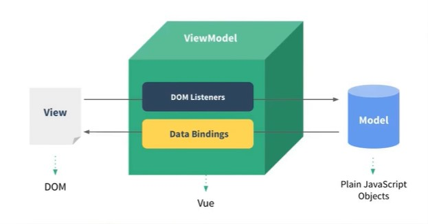
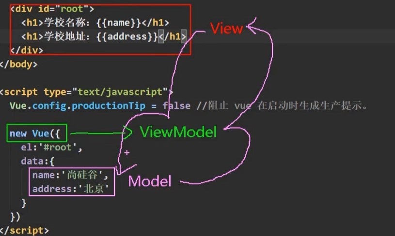
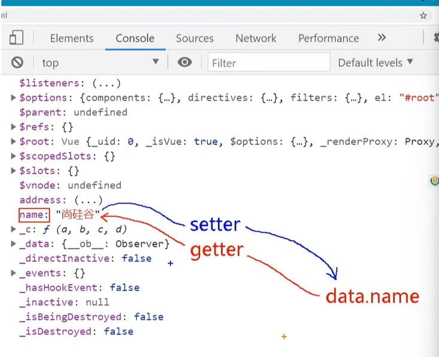
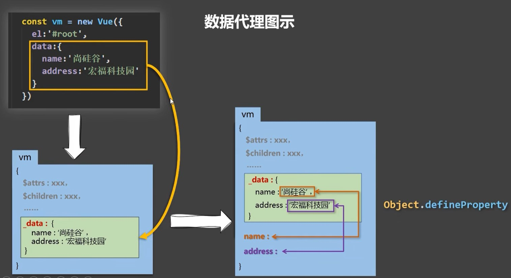
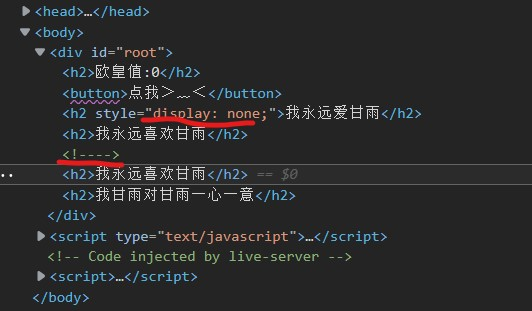
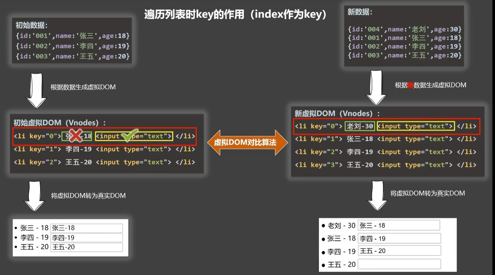
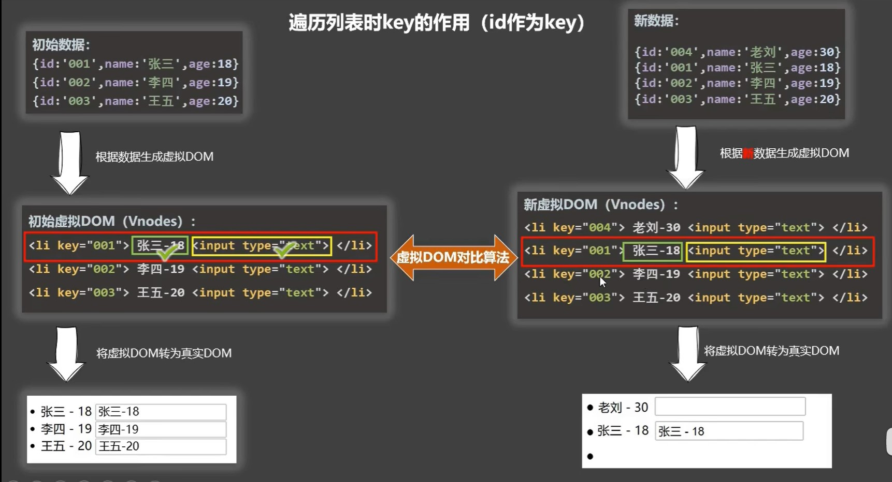
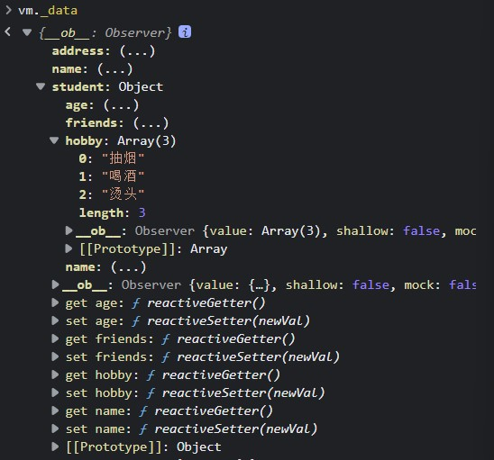
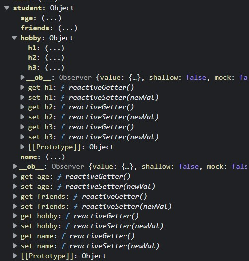
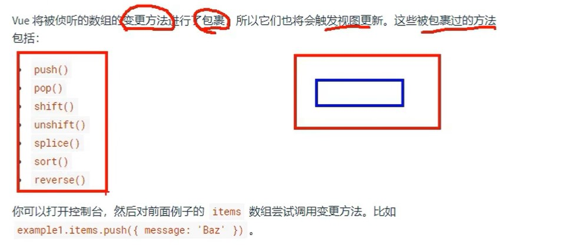

# Vue.js

<!-- TOC -->

- [Vue.js](#vuejs)
  - [1.1. **介绍**](#11-介绍)
  - [1.2. **初识**](#12-初识)
    - [创建Vue实例：](#创建vue实例)
    - [**注意**](#注意)
  - [1.3. 模板语法](#13-模板语法)
    - [插值语法](#插值语法)
    - [指令语法](#指令语法)
    - [1.3.3. 注意：data{中数据可嵌套}：点我](#133-注意data中数据可嵌套点我)
  - [1.4. 数据绑定](#14-数据绑定)
    - [单向数据绑定](#单向数据绑定)
    - [双向数据绑定](#双向数据绑定)
  - [1.5. el与data的两种写法](#15-el与data的两种写法)
    - [el：](#el)
    - [data](#data)
  - [1.6. MVVM模型](#16-mvvm模型)
  - [1.7. 数据代理](#17-数据代理)
    - [**定义**](#定义)
  - [1.8. 事件处理](#18-事件处理)
    - [事件基本使用](#事件基本使用)
    - [事件修饰符](#事件修饰符)
    - [键盘事件](#键盘事件)
  - [1.9. 计算属性&监视](#19-计算属性监视)
    - [计算属性](#计算属性)
    - [监视](#监视)
    - [**watch 与 computed**](#watch-与-computed)
  - [1.10. 绑定样式&style样式](#110-绑定样式style样式)
  - [1.11. 条件渲染](#111-条件渲染)
  - [1.12. 列表渲染](#112-列表渲染)
    - [基本列表](#基本列表)
    - [※key的作用&原理](#key的作用原理)
    - [列表过滤](#列表过滤)
    - [列表排序](#列表排序)
    - [注:](#注)
  - [1.13. 监测数据及原理](#113-监测数据及原理)
    - [是个问题](#是个问题)
    - [模拟Vue数据监测](#模拟vue数据监测)
    - [Vue.set()原理.html)](#vueset原理)
    - [监测数据数组原理](#监测数据数组原理)
    - [总结](#总结)
  - [1.14. 收集表单数据](#114-收集表单数据)
  - [1.15. 过滤器](#115-过滤器)
  - [1.16. 内置指令](#116-内置指令)
    - [v-text](#v-text)
    - [v-html](#v-html)
    - [v-cloak](#v-cloak)
    - [v-once](#v-once)
    - [v-pre](#v-pre)
  - [自定义指令](#自定义指令)
  - [1.17. 生命周期](#117-生命周期)
    - [引出生命周期](#引出生命周期)
    - [生命周期分析](#生命周期分析)
    - [总结生命周期](#总结生命周期)

<!-- /TOC -->

## 1.1. **介绍**

**一套用于构建用户界面的渐进式Javasript框架**

1. 组件化

   ```
   file.vue->{html,css,js}
   ```

2. 声明式编码

3. 虚拟DOM，Diff算法

   

**前置知识**：

1. ES6语法规范
2. ES6模块化
3. 包管理器（※）
4. 原型&原型链 
5. 数组常用方法
6. axios
7. promise


## 1.2. **初识**

1.  必须由Vue实例才能使Vue工作
2.  符合html规范语法
3.  root容器里的代码被称为【**模板代码**】 ->[点这里](./01初识vue.html)
4.  {{JS表达式}}，插值操作，显示表达式返回值
5.  真实开发过程中只有一个Vue实例，且与**组件**配合使用


###  创建Vue实例：

```javascript
const x=new Vue({配置对象})

new Vue({
  el:容器
  //通常为css选择器进行绑定
  //element eg: el:'...',
  //可用原生js进行绑定 eg：el:document.getElementById('...'),
  data:{
   value_tip:value,//存储数据，供el所指定容器使用
   //插值操作 {{value_tip}}
  }
})
```

### **注意**

1. 一个容器只对应一个Vue
2. 表达式：有返回值的式子。


## 1.3. 模板语法

### 插值语法

1. 用于解析标签体内容
2. {{JS表达式}}，读取JS表达式返回值的所有属性

```javascript
<...>...{data}... <...>
...
<script>
new Vue=({
  el:...,
  data:Data,
})
</script>
```

### 指令语法

1. 用于解析标签(包括：标签属性，标签体内容，绑定事件...)(v-bind,v-if,...)
2. v-bind:href="xxx"(可简写成 ``:href="xxx"``)

```javascript
<a :href="xxx" ></a>
<script>
new Vue=({
  el:...,
  xxx:Data,
})
</script>
```

### 1.3.3. 注意：data{中数据可嵌套}：[点我](./02%E6%A8%A1%E6%9D%BF%E8%AF%AD%E6%B3%95.html)

## 1.4. 数据绑定

### 单向数据绑定

**v-bind**: 从后台可修改数据显示（从data流向页面），在前台不能影响后台数据

### 双向数据绑定

**v-model**:前台和后台数据一起更改（还可从页面流向data）

**注**:``v-model只能应用于表单类元素，（value值）``

## 1.5. el与data的两种写法

### el：

```javascript
第一种:
const v=new Vue({
  el:...
})

第二种:
v.$mount(...)//这种更灵活点//挂截
```

### data

```javascript
第一种:对象式
data:{...}

第二种:函数式
data:function(){ return {}}函数式 
eg:
data:function(){
    console.log('@@@',this);//this->Vue对象
    return{
        name:"我永远喜欢甘雨",
    }
}
```

**注**：由Vue所管理的函数，建议不要写箭头函数，因为箭头函数的this指向的不是Vue对象

## 1.6. MVVM模型

1. M : Model:对应data中的数据
2. V : View :模板
3. VM: ViewModel:Vue实例对象




```
const vm=new Vue({})
```

1. data所有属性，最后都出现在vm上。
2. vm身上所有属性，都是Vue原型上的所有属性，在Vue模板中都可以直接使用。

## 1.7. 数据代理

```javascript
Object.defineProperty(对象，“属性名”，{配置})

Object.defineProperty(person,age,{
  value:18,
  enumerable:true,//控制属性是否可被枚举
  writable:true,//控制是否可被修改
  configurable:true,//控制是否可被删除
})

let number=0;
Object.defineProperty(person,age,{

//当读取age属性时，自动调用该函数
//get() or get:function(){}->getter
  get(){
    console.log("数据读取");
    return number;
  }
//当修改age时，setter自动被调用
  set(value){
    console.log("数据修改为"+value);
    number=value;
  }
})
```

### **定义**

```
通过一个对象代理另一个对象中属性的操作,非直接修改或赋予数据
```

[点这里](./06数据代理/06_III_数据代理.html)

Vue中的数据代理：

原理:


```javascript
   let data={
          name:"甘雨",
          address:"诚哥壶",
   };
   const  vm=new Vue({
      el:'#root',
      data
   });

1. vm中，vm._data将完全指向data，即同一个东西。
data===vm._data->true
2. vm自身将被赋有data的属性，联系Object.defineProperty()方法。
3. vm自动配置对_data对象的getter，setter方法，实现数据代理,可以通过修改或赋予vm.{data}的属性值来修改或赋予_data.{data}。
4. vm._data在配置时，采用了劫持数据的方式，当_data被直接更改时，vm中data属性也会对应更改。
```

## 1.8. 事件处理

### [事件基本使用](07事件处理/07_I%E4%BA%8B%E4%BB%B6%E5%A4%84%E7%90%86.html)

```javascript
v-on:{事件}=""
简写@{事件}=""

const vm=new Vue({
   el:'#root',
   methods:{
       showInfo1(){
           alert("雅蔑蝶");
       },
       showInfo2(){
           alert("还点，你nm呢，想挨叼是吧");
       }
   }
})
```

注:

1. 事件的回调应配置在**methods**配置项里，并最终在vm显示。
2. 在method配置**箭头函数**，则**this**指向window对象。
3. method配置函数this默认为**vm**或组件实例对象。
4. @click="demo($event)"与@click="demo"等价

### [事件修饰符](07事件处理/07_II事件修饰符.html)

1. ``prevent``:阻止默认行为 ->``.preventDefault()``
2. ``stop``: 阻止冒泡事件->``.stopPropagation()``
3. ``once``: 事件只触发一次
4. capture :使用事件捕获模式（在捕获时触发事件）
5. self :只有event.target是当前操作元素时才触发
6. passive :事件默认行为立即执行，无需等待事件回调执行完毕

注:

1. sroll滚动条，wheel鼠标滚轮
2. 链式编程：eg：``@click.prevent.stop``

### [键盘事件](./07事件处理/07_III键盘事件.html)

常用键盘事件：

1. **keyup**，按下后才触发
2. **keydown**，按下时才触发

（I）**Vue提供的别名**：可直接使用别名

```javascript
1. Enter 回车（13）（enter）
2. delete
3. esc 退出
4. space 空格
5. tab 换行（比较特殊，建议keydown）
6. up
7. down
8. left
9. right
```

（II）Vue为提供别名的，可以通过Key值/进行绑定。注意两个单词的->**kebab-case**

（III）不一定任何键都可以绑定

（IV）系统修饰键：ctrl(非control)，alt，shift，meta（windows:win键）

```javascript
1. keyup: 配合keyup：按下修饰键同时，再按下其他键，随后释放其他键，才可被触发
2. keydown:
```

（V）``Vue.config.keyCodes.{自定义键名}=键码``

注：链式编程:``@keyup.ctrl.y``

## 1.9. 计算属性&监视

### 计算属性

1. [＞﹏＜](./08计算属性&监视/08_I姓名案例&&methods.html)
2. [QAQ](./08计算属性&监视/08_I姓名案例&&插值语法.html)
3. [TAT](./08计算属性&监视/08_I姓名案例&计算属性.html)
4. [(—|—)](./08计算属性&监视/08_I姓名案例&计算属性简写.html)

**计算属性**：``vm中动态的属性，通过已有属性计算出的属性。computed获取的是计算属性的属性值``

**原理**：``底层借助 Object.defineproperty方法提供的getter，setter``

**优势**：``内部具有缓存机制，对效率有一定帮助，调试方便``

```javascript
computed:{//计算属性获取的是返回值，做vm的计算属性的计算属性值
 fullName:{
  //读取fullname时，getter会被调用
  //初次读取fullName,getter调用
  //所以来的值被修改时（缓存机制）
  get(){
      console.log(this);
      console.log('甘雨我爱你！！！')
      return this.firstName+'-'+this.lastName;
  },

  //当fullName被修改时，调用
  set(value){
      console.log('set',value);
      const arr =value.split('-');
      this.firstName=arr[0];
      this.lastName=arr[1];
  }//可以不写setter
 }
}

//fullName为计算属性名，getter返回计算属性值，其中this指向vm，

```

### 监视

1. [**监视**](./08计算属性&监视/08_II天气监视.html)

```javascript
1.
watch{
  ganyu:{
    // 初始时是否调用handler
    immediate:true/false,
    // 当属性发生改变时调用
    //undefined?当值不存在时。
    handler(newValue,oldValue){
      console.log(newValue,oldValue);
    }
  }
}

2.
$vm.watch('ganyu',{
  immediate:true/false,
  handler(newValue,oldValue){
    console.log(newValue,oldValue);
  }
})

```

2. [**深度监视**](./08计算属性&监视/08_II天气监视&深度监视.html)

   ```javascript
   deep:true/false//是否开启深度监视（考虑到效率问题，vue默认不开起）
   
   ```

   3.[简写](08计算属性&监视/08_II天气监视&简写.html)
   ``不能deep&immediate``

注：

1. slice(from,to);->截取字符串
2. 使用插值语法调用方法获取返回值时，括号不要省略。
3. 属性：eg``data:{[属性]:[属性值],...}``
4. 计算属性的简写形式仅当 ``不修改计算属性时（即不需要setter时）``才可以使用
5. 对象的属性都是 **字符串**

### [**watch 与 computed**](./08计算属性&监视/08_II姓名案例&watch实现.html)

1. ``computed``能完成的，``watch``也能完成。

2. ``watch``能完成的，``computed``不一定能完成。
   ``eg:异步操作``
   原则：

   ```javascript
   1. Vue管理的函数->写出普通函数->this->Vm
   2. 不被Vue管理的函数->(定时器的回调函数，ajax的回调函数，promose的回调函数等)->箭头函数，否则，this会直接指向本身，即windows
   ```

## 1.10. [绑定样式&style样式](./09绑定样式/09_I绑定样式&style样式绑定.html)

**绑定class选择器:**

```javascript
1. 字符串写法：
<!-- 字符串写法 适应于：样式类名不确定，需要动态指定-->
 <div class="base ganyu2" :class="mood1" @click="changeMood">{{name}}</div>
 vm=...{
  data:{
    mood1:'ganyu1',
  }
 }

2. 数组写法：
 <!-- 数组写法 绑定样式数目不确定，名字不确定 -->
<div class="base ganyu2" :class="styArr">{{name}}</div>
vm=...{
  data:{
    styArr:['ganyu1','ganyu2','ganyu3'],
  }
}

3. 对象写法：
<!-- 对象写法 适应于:个数确定，名字确定，需要动态决定 -->
 <div class="base ganyu2" :class="classsty">{{name}}</div>
 vm=...{
  data:{
    classsty:{
        ganyu1:true,
        ganyu2:true,
        ganyu3:true,
    },
  }
}
```

**style样式绑定**(不常用，其实)

```javascript
 <div class="base ganyu2" :style="styleObj">{{name}}</div>
 <div class="base ganyu2" :style="styleArr">{{name}}</div>

 vm=...{
  ...
  data:{
    styleObj:{
      fontSize:'40px',
      color:'red',
      backgroundColor:'orange',
    },
    styleArr:[
     {fontSize:'40px'},
     {
        color:'red',
        backgroundColor:'orange',
     }
    ]
  }
 }
```

## 1.11. [条件渲染](./10条件渲染/10条件渲染.html)

**v-show**：控制->存在/隐藏

```javascript
1. a为表达式
<h2 v-show="a">我永远喜欢{{name}}</h2>
const vm=new Vue({
   el:'#root',
   data:{
       name:'甘雨',
       a:false,
   }
})
```

**v-if/v-else-if/v-else**：控制->直接消失。

```javascript
<h2 v-if="n%4==0">我{{name}}对甘雨一心一意</h2>
<h2 v-else-if="n%2==0">我永远爱{{name}}</h2>
<h2 v-else if>我永远喜欢{{name}}</h2>

data:{
  name:'甘雨',
  n:0,
}
```


注：

1. v-if/v-else需要连续
2. v-if可能会拿不到节点 ``false->直接笑死``
3. **template**标签

## 1.12. 列表渲染

### [基本列表](./11列表渲染/11_I基本列表.html)

```javascript
方式一：v-for="[形参] in [引用对象数组]":key="..."
<ul>
    <li v-for="person in persons":key="person.id">
        {{person.name}}-{{person.age}}
    </li>
</ul>

方式二: v-for="(value[形参],index[下标])":key="..."
<ul>
   <li v-for="(p,index) in persons":key="index">
       {{p.name}}-{{p.age}}--{{index}}
   </li>
</ul>

方式三：v-for="(value[对象形参],k)":key="..."
<ul>
   <li v-for="(value,k) in car":key="k">
       {{k}}--{{value}}//对象属性名，对象属性值
   </li>
</ul>

方式四：v-for="... in [string]":key="..."（少）
<ul>
   <li v-for="(char,index) in str":key="index">
       {{index}}--{{char}}
   </li>
</ul>

方式五：v-for="... in [遍历次数]":key="..."（少）
<ul>
   <li v-for="(number,index) in 5":key="index">
       {{number}}
   </li>
</ul>

data:{
    persons:[
        {id:'001',name:'甘雨',age:18},
        {id:'002',name:'甘雨',age:19},
        {id:'003',name:'甘雨',age:20},
    ],
    car:{
        name:'奥迪',
        price:'114514',
        color:'无色'
    },
    str:'hello',
}
```

### [※key的作用&原理](11列表渲染/11_IIkey作用与原理.html)

``v-for="":key=""``->对每位调用变量进行标识。

(在虚拟DOM（``Document_Object_Model``）中)作用：``key作为虚拟DOM对象的标识，当数据发生变化时，Vue会根据[新数据]生成[新虚拟DOM],随后Vue进行[新虚拟DOM]与[旧虚拟DOM]的差异比较(Diff算法)``

```
Diff算法：
（1）寻找相同key值：
  1. 若DOM中内容没变，直接使用原来的真实DOM
  2. 若改变，则生成新的真实DOM顶替原来的DOM内容
（2）DOM中未知道key：
     直接创建新DOM

使用index为key时问题：
（1）对数据进行逆序添加，删除等破坏顺序:
    使用Diff算法，产生没必要的DOM更新，效率低
（2）当结构包含输入类时，可能造成界面问题。

若不写key：以index作为key
//效率低
<ul>
   <li v-for="(p,index) in persons":key="index">
       {{p.name}}-{{p.age}}
   </li>
</ul>
//输入框问题
<ul>
   <li v-for="(p,index) in persons":key="index">
       {{p.name}}-{{p.age}}
       <input type="text">
   </li>
</ul>
//正常写法
<ul>
   <li v-for="(p,index) in persons":key="p.id">
       {{p.name}}-{{p.age}}
       <input type="text">
   </li>
</ul>

data:{
    persons:[
        {id:'001',name:'甘',age:18},
        {id:'002',name:'雨',age:19},
        {id:'003',name:'甘雨',age:20},
    ],
},
methods:{
    add(){
        const p={id:'004',name:'甘-雨',age:40};
        this.persons.unshift(p);
    }
}
```




### [列表过滤](./11列表渲染/11_III列表过滤.html)

```
watch 监视写法
<input type="text" name="" id="" placeholder="请输入名字" v-model="keyword">
<ul>
   <li v-for="(p,index) in filPersons":key="p.id">
       {{p.name}}--{{p.age}}--{{p.sex}}
   </li>
</ul>

data:{
    keyword:'',
    persons:[
           {id:'001',name:'马冬梅',age:19,sex:'girl'},
           {id:'002',name:'周冬雨',age:20,sex:'girl'},
           {id:'003',name:'周杰伦',age:20,sex:'man'},
           {id:'004',name:'温兆伦',age:22,sex:'man'},
    ],
    filPersons:[],
}
watch:{
 keyword:{
     immediate:true,
     handler(newValue){
         this.filPersons=this.persons.filter((p)=>{  
             return p.name.indexOf(newValue)!==-1;
         })
     },
}
// keyword(newValue){
//     console.log("乐",newValue);
//     this.filPersons=this.persons.filter((p)=>{  //过滤元素
//         return p.name.indexOf(newValue)!==-1;//返回新数组//' '->0
//     })
// }//未输入时，不显示任何信息。 
computed（计算属性）写法
computed:{
   CfilPersons(){
     return this.persons.filter((p)=>{
         return  p.name.indexOf(this.keyword)!==-1;
     });
   }
}//发生改变时，自动调用。
```

### [列表排序](./11列表渲染/11_IV列表排序.html)

1. sort函数``return a-b | 不能写 a<b``

### 注:

1. [].filter((...)=>{})为数组元素过滤函数，返回数组
2. (String).indexOf(value)->返回找到value的第一个索引值，如果value为空串，返回0，若找不到，返回-1。

## 1.13. 监测数据及原理

### [是个问题](12监测数据&原理/是个问题.html)

```javascript
 methods:{
    updataf(){
      // 可被Vue实时监测
      // this.persons[0].name="马老师";
      // this.persons[0].age="50";
      // this.persons[0].sex="maxn";

      //不可被Vue实时监测
      this.persons[0]={id:'001',name:'马laos',age:50,sex:'maxn'};//
    }
}
```

### [模拟Vue数据监测](12监测数据&原理/模拟Vue数据监测.html)


```
原生js简单模拟Vue监测时，需要借助额外全局对象（Observer）进行实时监测，避免在获取/修改属性时死循环。
```

### [Vue.set()原理](12监测数据&原理/Vue.set().html)

```javascript
//为Vue添加属性以及set/get方法->实现响应式。
//原理 | 数据代理。
Vue.set(target,pro,value);
vm.$set(target,pro,value);
```

**注**：

1. 所加属性不能是Vm实例或Vm根数据对象(即vm._data)，因为Vue无法探测普通的新增属性

### [监测数据数组原理](12监测数据&原理/监测数据改变原理_数组.html)

数组元素（非对象）未被监测->通过重载数组方法，实现响应式




### [总结](12监测数据&原理/总结.html)

1. vue监视data所有层次数据
2. 监测对象原理：set、数据代理
3. 监测数组原理：重载数组原生方法，使用方法时重新解析
4. Vue数组:push(),pop(),shift(),unshift(),splice(),sort(),reverse()|Vue.set,vm.$set
5. 数据劫持：监视数据变化->重新解析模板

## 1.14. [收集表单数据](13收集表单数据/收集表单数据·.html)

```javascript
1. <input type='text'/> -> v-model收集的是value
2. <input type='radio'/> -> v-model收集的是value
3. <input type='checkbox'/> -> 没配置value->收集的是checked(boolean)、配置value->(1)v-model非数组：checked(boolean) (2)数组，收集的是value组成的数组
4. v-model的修饰符:
  i.   lazy：失去焦点，后再收集数据
  ii.  number：输入字符转有效数字
  iii. trim：过滤掉空格
```

## 1.15. [过滤器](14过滤器/过滤器.html)

```
  对显示的数据进行简单的特定格式化后再显示。
  1.创建过滤器：Vue.filter(name,funtion(value){}),new Vue{filters:{}}
  2.使用：{{xxx|过滤器}} / v-bind: 属性="xxx|过滤器"
```

## 1.16. 内置指令

### [v-text](15内置指令/01_v-text.html)

1. 向其所在节点中渲染文本内容。
2. v-text会替换掉节点中的内容，而{{xx}}不会

### [v-html](15内置指令/02_v-html.html)

```
v-html作用：向指定节点中渲染包含html结构内容。
```

1.  会替换掉节点中所有内容。
2.  会识别html结构
3.  不要在网站上动态渲染任意HTML，任意导致xss攻击
4.  要在可信内容上使用v-html，且禁止用于在用户提交上 

### [v-cloak](15内置指令/03_v-cloak.html)

``v-cloak``（斗篷，遮挡物）：

1.  Vue创建的特殊属性，当Vue实例创建完毕后接管容器，并删除v-cloak属性。
2.  使用css配合v-cloak可以解决网速过慢而展示未解析模板问题。

### [v-once](15内置指令/04_v-once.html|)

``v-once``: v-once所在节点在初次动态渲染后，就视为静态内容。

注：区别于事件修饰符：once

### [v-pre](./15内置指令/05_v-pre.html)

``v-pre``:

1.  跳过其所在节点的编译过程。
2.  对于未使用任何Vue指令的代码，可用v-pre跳过，提高效率

## [自定义指令](16自定义指令/自定义指令.html)

1. 定义语法：
   （1）局部指令：``new Vue({ directives:{指令名：配置对象/指令名：function（）} })``
   （2）全局指令：``Vue.directive(指令名，配置对象)/Vue.directive(指令名，回调函数)``
2. 配置对象中常用的3个回调：
   （1）.bind：指令与元素成功绑定时调用。
   （2）.inserted:指令所在元素被插入页面时调用。
   （3）.update:指令所在模板结构被重新解析时调用。
3. 注：
   （1）.指令定义时不加v-，使用时v-
   （2）指令如果由多个单词，采用’-‘间隔，不使用驼峰命名
   （3）Vue解析模板->渲染html结构

## 1.17. 生命周期

### [引出生命周期](17生命周期/01引出生命周期.html)

```javascript
    <!-- 
        生命周期：
        1. 又名：生命周期回调函数、生命周期函数，生命周期钩子
        2. Vue在关键时刻时所调用的特殊时期的函数
        3. 生命周期函数名字不可更改
        4. 生命周期函数this指向vm/组件实例对象
    -->
```


### [生命周期分析](17生命周期/02分析生命周期.html)

```javascript
1. beforeCreate
2. created

3. beforeMount
4. mounted

5. beforeUpdata
6. updated

7. beforeDestroy
8. destroyed
```

### [总结生命周期](17生命周期/03总结生命周期.html)

```javascript
<!-- 
  常用钩子：
  1. mounted: 发生ajax请求，启动定时器，绑定自定义事件，订阅信息等[初始化操作]
  2.beforeDestroy:清除定时器，解绑自定义事件，取消订阅信息等。

  关于销毁Vue实例注解：
  1. 销毁后Vue将彻底死透（2022年9月版本更新后）
  2. 一般不会被beforeDestroy操作数据
  3. 销毁后原生DOM仍在
-->
```


注：

1. 挂载：Vue完成模板解析后，把初始真实DOM元素放入界面