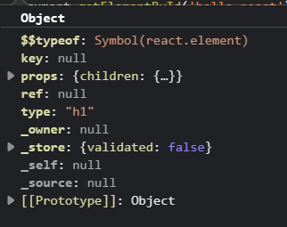
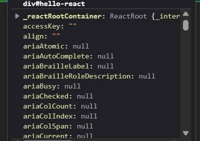
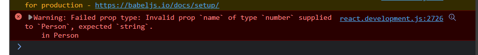
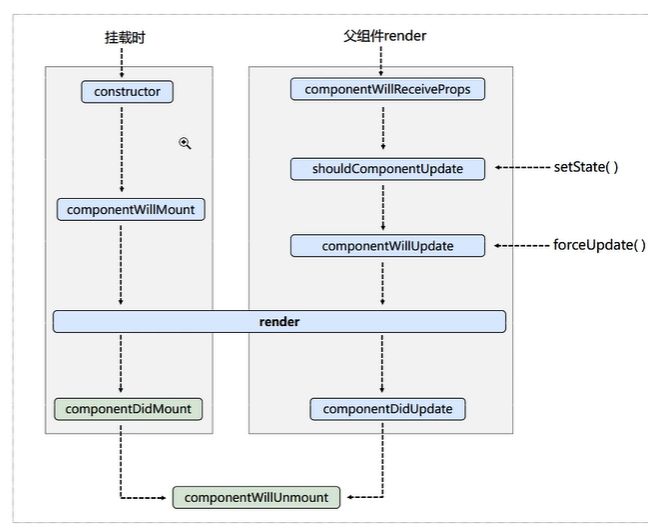
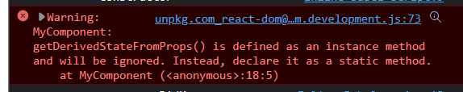
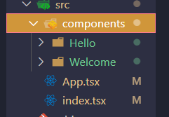
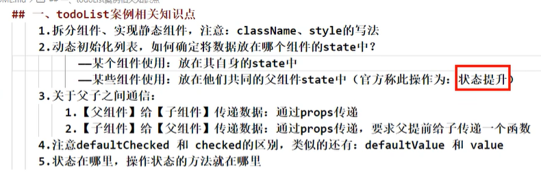

# react学习笔记

类式组件

## react 基本

### 虚拟dom编写

```html
<script type="text/javascript" src="../react/react.development.js"></script>
<script type="text/javascript" src="../react/react-dom.development.js"></script>
<script type="text/javascript" src="../react/babel.min.js"></script>
<script type="text/babel">
    // 使用jsx，那么此处就要写text/babel
    // 如果只使用js，那么对于嵌套标签实现vdom，会非常麻烦
    const VDOM = (
        <h1>
            <div>Hello React</div>
        </h1>)
    ReactDOM.render(VDOM, document.getElementById('hello-react'));
</script>
```

### 虚拟dom与真实dom

1. 虚拟dom本质上是一个Object类型对象（一般对象）

2. 虚拟dom在React内部使用，无需真实dom的许多属性

3. vdom最终会被转化成tdom

   vdom：

   

   tdom：




### jsx语法规则

jsx语法规则:

1. 定义虚拟DOM时，不要写引号。
2. 标签中混入JS表达式时要用{}
3. 样式的类名指定不要用class，要用className。
4. 内联样式，要用style={ {key:value} }的形式去写。
5. 只有一个根标签
6. 标签必须闭合
7. 标签首字母
   - 若小写字母开头，则将该标签转为html中同名元素，若html中无该标签对应的同名元素
   - 若大写字母开头，react就去渲染对应的组件，若组件没有定义，则报错。

#### jsx小练习

```react
<script type="text/babel">
  const data = ["Angular", "React", "Vue"];
  const VDom = (
    <div>
      <h1>前端js框架列表</h1>
      <ul>
        {data.map((item, index) => {
          return <li key={index}>{item}</li>;
        })}
      </ul>
    </div>
  );
  ReactDOM.render(VDom, 		   document.getElementById("test"));
</script>
```


### 组件

#### 函数式组件

```react
 function MyComponent(){
        console.log(this);
        return <h2>函数式组件</h2>
      }
      ReactDOM.render(<MyComponent/>, document.getElementById('test'));
    </script>
```

#### 类式组件

```react
class Mycomponent extends React.Component{
        render(){
            /**
             * render-> 位于MyComponent原型对象上，this指向实例对象,组件实例对象
            */
            console.log('render的this', this);
            return <h2>类式组件</h2>
        }
     }
      ReactDOM.render(<Mycomponent/>, document.getElementById("test"));
    /**
     * 执行了ReactDOM.render(<MyComponent/>.......之后，发生了什么?
        1.React解析组件标签，找到了MyComponent组件。
        2.发现组件是使用类定义的，随后new出来该类的实例，并通过该实例调用到原型上的render方法。
        3.将render返回的虚拟DOM转为真实DOM，随后呈现在页面中。
    */
```

## 组件三大核心

### state

[严格模式 - JavaScript | MDN (mozilla.org)](https://developer.mozilla.org/zh-CN/docs/Web/JavaScript/Reference/Strict_mode)


```react
class MyComponent extends React.Component {
        constructor(props) {
          super(props);
          this.state = { isHot: false, wind: "微疯" };
          // 使用.bind函数，为this作用域绑上函数change，缺点->消耗内存
          this.change = this.change.bind(this);
        }
        // render -> 修改state，刷新domn次，调用render1+n次
        render() {
          console.log("render的this", this);
          const { isHot, wind } = this.state;
          return (
            <h2 onClick={this.change}>
              你好{isHot ? "骚" : "low"}啊, {wind}
            </h2>
          );
        }
        change() {
          // change位于MyComponent原型上
          // change, 作为onClick回调，将函数指针绑定给onClick，不是由实例调用，是直接调用
          // 类中方法，默认开启局部严格模式，'use stirct'，-> undefined
          console.log(this);

          // 响应式数据 -> setState刷新dom
          // 不可直接更改数据
          const { isHot } = this.state;
          this.setState({ isHot: !isHot });
        }
      }
      const demo = () => {
        alert("Hello React");
      };
      ReactDOM.render(<MyComponent />, document.getElementById("test"));
```


#### state理解

1. 存储数组状态/数据的内部机制
2. 存储管理/动态使用数据

```react
使用：
constructor(props) {
  super(props);
  this.state = { isHot: false, wind: "微疯" };
}
```

#### state&实例方法使用

需要理解`'use strict'`严格模式：

严格限制作用域

eg：

```js
demo调用需要上下文确定作用域
启用了严格模式（'use strict'），当没有指定上下文时，阻止了将this默认绑定到全局对象（在浏览器中为window或在Node.js中为global）。

function demo() {
    'use strict'
    console.log(this);
}
function demo2() {
    console.log(this);
}
demo();         // undefined
demo2();        // this
```


使用：

```react
 constructor(props) {
  super(props);
  this.state = { isHot: false, wind: "微疯" };
  // 使用.bind函数，为this作用域绑上函数change，缺点->消耗内存
  this.change = this.change.bind(this);
}
 render() {
  console.log("render的this", this);
  const { isHot, wind } = this.state;
  return (
    <h2 onClick={this.change}>
      你好{isHot ? "骚" : "low"}啊, {wind}
    </h2>
  );
}
```


#### 响应式数据

使用setState刷新dom

```react
change() {
  const { isHot } = this.state;
  this.setState({ isHot: !isHot });
}
```


#### 简写

```react
class MyComponent extends React.Component {
        constructor(props) {
          super(props);
        };
        state = {
          isHot: false,
          wind: "微疯",
        };
        render() {
          const { isHot, wind } = this.state;
          return (
            <h2 onClick={this.change}>
              你好{isHot ? "骚" : "low"}啊, {wind}
            </h2>
          );
        };
        change = () => {
          const { isHot } = this.state;
          this.setState({ isHot: !isHot });
        };
      }
```

### props

[展开语法 - JavaScript | MDN (mozilla.org)](https://developer.mozilla.org/zh-CN/docs/Web/JavaScript/Reference/Operators/Spread_syntax)

Props -> readOnly

#### props-数据传入

```react
class Person extends React.Component {
    render() {
      const { name, age, sex } = this.props;
      return (
        <ul>
          <li>姓名：{this.props.name}</li>
          <li>年龄：{this.props.age}</li>
          <li>性别：{this.props.sex}</li>
        </ul>
      );
    }
  }
  const p = { name: "joshua", age: "18", sex: "girl" };

// 传入具体变量：key-value
// age = {[NUMBER]}, 会解析[NUMBER]变量/常量
  ReactDOM.render(
    <Person name="jerry" age={18} sex="boy" />,
    document.getElementById("test")
  );
// 传入解构变量，react+babel允许的文法。一层深拷贝
// 具体看文档/看reView
  ReactDOM.render(<Person {...p} />, document.getElementById("test2"));
  ReactDOM.render(
    <Person name="mONsy" age="19" sex="boy" />,
    document.getElementById("test3")
  );
```

#### props限制

```react
  Person.propTypes = {
    // name: React.PropTypes.string// <=15
    // 类型使用小写开头避免关键字冲突
    name: PropTypes.string.isRequired,
    sex: PropTypes.string,
    age: PropTypes.number,
    speak: PropTypes.func,
  }
  function speak(){
    console.log(6);
  }
  Person.defaultProps = {
    sex: '母鸡',
    age: '18',
    speak: speak,
  }

  const p = { age: 18, sex: "girl" };
  ReactDOM.render(
    <Person name="jerry" age={18} speak = {()=>{console.log('666')}}/>,
    document.getElementById("test")
  );
  ReactDOM.render(<Person {...p} />, document.getElementById("test2"));
  ReactDOM.render(
    <Person name="mONsy" sex="boy" />,
    document.getElementById("test3")
  );
```




#### props封装

```react
  class Person extends React.Component {
    static propTypes = {
      // name: React.PropTypes.string// <=15
      // 类型使用小写开头避免关键字冲突
      name: PropTypes.string.isRequired,
      sex: PropTypes.string,
      age: PropTypes.number,
      speak: PropTypes.func,
    };
    static defaultProps = {
      sex: "母鸡",
      age: "18",
      speak: function (){
        console.log(6);
      },
    };
    render() {
      const { name, age, sex, speak } = this.props;
      speak();
      return (
        <ul>
          <li>姓名：{name}</li>
          <li>年龄：{age + 1}</li>
          <li>性别：{sex}</li>
        </ul>
      );
    }
  }
```

#### 构造函数

```react
// 构造器接收props，-> 希望构造器this访问props
constructor(props){
    super(props);
    console.log(this.props);// object
    
    super();
    console.log(this.props)	// undefined
}
```

#### 函数式组件使用props

函数式组件只能使用props

```react
      function Person(props) {
        return (
          <ul>
            <li>姓名：{props.name}</li>
            <li>年龄：{props.age + 1}</li>
            <li>性别：{props.sex}</li>
          </ul>
        );
      }

      Person.propTypes = {
        name: PropTypes.string.isRequired,
        sex: PropTypes.string,
        age: PropTypes.number,
      };
      Person.defaultProps = {
        sex: "男",
        age: 18,
      };
```

### refs

#### 字符串refs使用

已过时：被废弃。

原因：

```react
1、string ref 不可组合
例：第三方库的父组件已经给子组件传递了 ref，那么我们就无法再在子组件上添加 ref
class MyComponent extends React.Component {
  componentDidMount() {
    // this.refs.child 无法获取到 
    console.log(this.refs);
  }

  render() {
    return ( <Parent> <Child ref="child" /> </Parent> );
  }
}

2、回调引用没有一个所有者，因此您可以随时编写它们
3、不适用于Flow之类的静态分析
4、string ref 强制React跟踪当前正在执行的组件
```


类似于Vue的ref

```react
class MyCom extends React.Component{
    showData = ()=>{
        alert(this.refs.input1.value);
    }
    showDate2 = ()=>{
        alert(this.refs.input2.value);
    }
    render(){
        return(
            <div>
                <input ref='input1' type="text" placeholder="点击按钮提示数据"/>&nbsp;
                <button onClick={this.showData}>点击提示左侧数据</button>&nbsp;
                <input ref='input2' onBlur={this.showDate2} type="text" placeholder='失去焦点提示数据' />
            </div>
        )
    }
  }
```

#### 回调函数形式Ref

1. 内联函数写法：

    ```react
    class MyCom extends React.Component {
        // 创建组件
        state = {
          isHot: true,
        };
        showData = () => {
          console.log(this);
        };
        saveInput = (curNode) => {
          console.log("@", curNode);
        };
        render() {
          const { isHot } = this.state;
          return (
            <div>
              <h2>你好{isHot ? "low" : "骚"}啊</h2>
              <input
                ref={(curNode) => {
                  this.input1 = curNode;
                  console.log("@", curNode);
                }}
                type="text"
            />
              &nbsp;
              <button onClick={this.showData}>点击提示左侧数据</button>&nbsp;
              <button
                onClick={() => {
                  this.setState({ isHot: !isHot });
                  console.log(isHot);
                }}
              >
                点击切换
              </button>
            </div>
          );
        }
      }
    ```
    问题:

    如果 ref 回调函数是以内联函数的方式定义的，在更新过程中它会被执行两次，第一次传入参数 null，然后第二次会传入参数 DOM 元素。这是因为在每次渲染时会创建一个新的函数实例，所以 React 清空旧的 ref 并且设置新的。通过将 ref 的回调函数定义成 class 的绑定函数的方式可以避免上述问题，但是大多数情况下它是无关紧要的。

2. class绑定函数

    ```react
    saveInput = (curNode) => {
      console.log("@", curNode);
    };
    render() {
      const { isHot } = this.state;
      return (
        <div>
          <h2>你好{isHot ? "low" : "骚"}啊</h2>
          <input ref={this.saveInput} type="text" />
          &nbsp;
          <button onClick={this.showData}>点击提示左侧数据</button>&nbsp;
          <button
            onClick={() => {
              this.setState({ isHot: !isHot });
              console.log(isHot);
            }}
          >
            点击切换
          </button>
        </div>
      );
    }
    
    // render重新渲染，class的function不会被清，使用只会调用一次
    ```

    #### createRef
    
    ```react
    class MyCom extends React.Component {
        // createRef create Ref容器，每个ref绑定一个dom
        myRef = React.createRef();
        showData = () => {
        // 异步的？先输出了this，再输出了this.myRef.current
          console.log(this, this.myRef.current);
          alert(this.myRef.current.value);
        };
        render() {
          return (
            <div>
              <input ref={this.myRef} type="text" />
              &nbsp;
              <button onClick={this.showData}>点击提示左侧数据</button>&nbsp;
            </div>
          );
        }
      }
    ```
    
    

### 事件处理

```react
/**
* (1).通过onXxx属性指定事件处理函数(注意大小写)
*  a.  React使用的是自定义(合成)事件，而不是使用的原生DOM事件  为了更好的兼容性
*  b.  React中的事件是通过事件委托方式处理的(委托给组件最外层的元素)--为了的高效
* (2).通过event.target得到发生事件的DOM元素对象 -不要过度使用ref
*/
```

## react表单数据

尽量避免过多ref的使用

在表单事件时，使用state实现类似于v-model的效果

### 非受控组件

```react
class Login extends React.Component {
    handleSubmit = (event) => {
      event.preventDefault();// 阻止默认提交刷新事件
      const {username, password} = this;
      alert(`你输入username：${username.value}, password：xxx`)
    }
    render() {
      return (
        // action="https://130357.xyz"
        <form onSubmit={this.handleSubmit}>
          用户名：
          <input ref={c=>this.username = c}type="text" name="userName"/>
          密码：
          <input ref={c=>this.password = c}type="password" name="password"/>
          <button>Login</button>
        </form>
      );
    }
  }
```


### 受控组件

```react
class Login extends React.Component {
    // 类似于v-model
    state = {
      username: '',
      password: '',
    }
    setUsername = (event)=>{
      this.setState({username: event.target.value});
    }
    setPassword = (event)=>{
      this.setState({password: event.target.value});
    }

    handleSubmit = (event) => {
      // event.preventDefault();// 阻止默认提交刷新事件
      alert(`你输入username：${this.state.username}, password：xxx`)
    }
    render() {
      return (
        // form默认GET
        <form action="https://130357.xyz" onSubmit={this.handleSubmit}>
          用户名：
          <input onChange={this.setUsername} type="text" name="userName"/>
          密码：
          <input onChange={this.setPassword} type="password" name="password"/>
          <button>Login</button>
        </form>
      );
    }
  }
```

区别：

1. 受控组件是指使用React state来管理组件中的值或状态，并通过props将它们传递给子组件。这意味着组件的值或状态是由React控制的，React会负责更新组件的状态并重新渲染组件。当用户与组件交互时，组件将调用回调函数来更新状态，这将触发重新渲染组件。例如，一个文本框可以被定义为受控组件，因为它的值由React控制。

2. 非受控组件是指组件的值或状态不受React控制，而是由DOM本身控制。组件可以访问DOM元素并从中获取值或状态，但React不会跟踪这些值或状态。当用户与组件交互时，组件将直接更新DOM，而不会触发React的重新渲染。例如，一个文件上传组件可以被定义为非受控组件，因为它的值由用户选择的文件决定，而不是React控制的状态。

### 高阶函数&函数柯里化


## 生命周期

### 引入

```react
 /**
   * mount：挂载，unmount：卸载
   */

/**
 * componentDidMount()
 * componentWillUnmount()
 */

  class MyComponent extends React.Component {
    state = {
      opacity: 1,
    };
    timer = null;
    death = () => {
      ReactDOM.unmountComponentAtNode(document.getElementById("test"));
    };
    componentDidMount() {
      this.timer = setInterval(() => {
        let { opacity } = this.state;
        if (opacity <= 0) {
          opacity = 1.0;
        } else {
          opacity -= 0.1;
        }
        this.setState({ opacity });
        // console.log(opacity);
      }, 100);
    }
    componentWillUnmount() {
      clearInterval(this.timer);
    }
    render() {
      return (
        <div>
          <h2 style={{ opacity: this.state.opacity }}>啊啊啊~，想死掉了</h2>
          <button onClick={this.death}>人生重开</button>
        </div>
      );
    }
  }
```

### 周期

（类似于vue生命周期）

旧（<= 16.x）：



新：


1. 初始化阶段: 由ReactDOM.render()触发---初次渲染
   1. constructor()
   
   2. componentwillMount()
   
   3. render()
   
   4. componentDidMount()
   
      （***）初始化（开启定时器、网络请求、消息订阅）
   
2. 更新阶段: 由组件内部this.setstate()或父组件重新render触发
   1. shouldComponentUpdate()
   2. componentWillUpdate() (<= 强制更新)
   3. render()
   4. componentDidUpdate()
   
3. 卸载组件: 由ReactDOM.unmountComponentAtNode()触发 
   1. componentWillUnmount()
   
      （关闭定时器、取消消息订阅）

### 示例

```react
class MyComponent extends React.Component {
        constructor(props) {
          super(props);
          this.state = { sum: 0 };
          console.log("----------constructor-----------");
        }
        componentWillMount() {
          console.log("----------componentWillMount-----------");
        }
        componentDidMount() {
          console.log("----------componentDidMount-----------");
        }
        componentWillUnmount() {
          console.log("----------componentWillUnmount-----------");
        }

        /**
         * @return true|false;
         */
        shouldComponentUpdate() {
          console.log("----------shouldComponentUpdate-----------");
          return true;
          //   return false;
        }
        componentWillUpdate() {
          console.log("----------componentWillUpdata-----------");
        }
        componentDidUpdate() {
          console.log("----------componentDidUpdata-----------");
        }

        add = () => {
          let { sum } = this.state;
          sum += 1;
          this.setState({ sum });
        };
        force = () => {
          this.forceUpdate();
        };
        death = () => {
          ReactDOM.unmountComponentAtNode(document.getElementById("test"));
        };
        render() {
          return (
            <div>
              <div>点击求和：{this.state.sum}</div>
              <button onClick={this.add}>++</button>
              <button onClick={this.death}>人生重开</button>
              <button onClick={this.force}>强制更新</button>
            </div>
          );
        }
      }
```

父子组件嵌套


```react
class B extends React.Component {
    // 应该叫componentWillReceiveNewProps，更合适
    componentWillReceiveProps(){
        console.log("----------componentWillReceiveProps-----------");
    }

    shouldComponentUpdate() {
      console.log("----------shouldComponentUpdate-----------");
      return true;
      //   return false;
    }
    componentWillUpdate() {
      console.log("----------componentWillUpdata-----------");
    }
    componentDidUpdate() {
      console.log("----------componentDidUpdata-----------");
    }
    render() {
      const { car } = this.props;
      return <div>B: {car}</div>;
    }
  }
  class A extends React.Component {
    state = {
      car: "byd",
    };
    change = () => {
      this.setState({ car: "dyb" });
    };
    render() {
      return (
        <div>
          <div>A组件</div>
          <button onClick={this.change}>换车</button>
          <B car={this.state.car}></B>
        </div>
      );
    }
  }
```

### 生命周期（>= 17.x）

废弃三个钩子：

1. componentWillMount
2. componentWillUpdate
3. componentWillReceiveProps

但仍可以使用，不过，要加UNSAFE_前缀（eg. ``UNSAFE_componentWillMount``）

原因：

在业务中存在大量错误使用的情况，造成bug或者潜在bug，在最新版本实现的异步渲染中，这个问题可能会更明显，所以决定弃用这个生命周期。

但引入两个新钩子

1. getDericedStateFromProps

   Dericed（派生的，衍生的）

2. getSnapshotBeforeUpdate

   Snapshot（快照）


#### getDericedStateFromProps

通过props派生出state



使用：

```react
static getDerivedStateFromProps(props, state){
      console.log('------getDerivedStateFromProps------', props, state)
      // return {sum: 101};
      return props
    }
```


适用于组件state完全依赖于props的情况（但是会导致代码冗余，死得后期难以维护）

#### getSnapshotBeforeUpdate

在dom更新之前获取快照，将值返回给componentDidUpcdate钩子

可用于滑动条滚动等场景

示例：

```react
class NewsList extends React.Component {
        state = { newsArr: [] };

        getSnapshotBeforeUpdate() {
          return this.refs.list.scrollHeight;
        }
        componentDidUpdate(prevprops, prevstate, height) {
          // console.log(this.refs.list.scrollTop);
          console.log(
            this.refs.list.scrollHeight - height,
            this.refs.list.scrollTop,
            this.refs.list.scrollHeight
          );
          if (this.refs.list.scrollTop) {
            this.refs.list.scrollTop += this.refs.list.scrollHeight - height;
          }
          console.log(this.refs.list.scrollTop);
        }
        componentDidMount() {
          setInterval(() => {
            const { newsArr } = this.state;
            const news = "新闻" + (newsArr.length + 1);
            this.setState({ newsArr: [news, ...newsArr] });
            // console.log(newsArr.length);
          }, 2000);
        }

        render() {
          return (
            <div className="list" ref="list">
              {this.state.newsArr.map((n, index) => {
                return (
                  <div key={index} className="news">
                    {n}
                  </div>
                );
              })}
            </div>
          );
        }
      }
      ReactDOM.render(<NewsList />, document.getElementById("test"));
```

### diff算法

diff算法是最低粒度是节点标签（包括文本节点、标签节点）

1. 虚拟DOM中key的作用:
   - 简单的说: key是虚拟DOM对象的标识，在更新显示时key起着极其重要的作用。
   - 详细的说: 当状态中的数据发生变化时，react会根据[新数据] 生成[新的虑拟DOM]随后React进行[新虚拟DOM] 与[旧虚拟DOM]的diff比较，比较规则如下:
     1. 旧虚拟DOM中找到了与新虚拟DOM同的key:(1).若虚拟DOM中内容没文直接使用之前的真实DOM(2).若虚拟DOM中内容变了则生成新的直实DOM，随后替换掉页面中之前的直实DOM
     2. 旧虚拟DOM中未找到与新虚拟DOM相同的key根据数据创建新的真实DOM，随后渲染到到页面
2. index作为key可能会引发的问题:
1. 若对数据进行:逆序添加、逆序删除等破坏顺序探作:会产生没有必要的真实DOM更新 ==> 界面效果没问题，但效率低。
2. 如果结构中还包含输入类的DOM:会产生错误DOM更新 ==> 界面有问题。
3. 注意!如果不存在对数据的逆序添加、逆序删除等破坏顺序操作，仅用于渲染列表用于展示，使用index作为key是没有问题的。

## react脚手架(scaffolding)

1. 安装react脚手架：

   ``npm i -g create-react-app``

2. 创建项目：

   create-react-app hello-react

- npm start

- npm test

- npm run build

- npm run eject(喷射，暴露)

  直接将webpack相关配置文件暴露，且不可逆


### 文件目录介绍：

1. public

   ```react
   public ---- 静态资源文件夹
   		favicon.icon ------ 网站页签图标
   		index.html -------- 主页面
   		logo192.png ------- logo图
   		logo512.png ------- logo图
   		manifest.json ----- 应用加壳的配置文件
   		robots.txt -------- 爬虫协议文件
   
   ```

   index.html:

   ```html
   <!DOCTYPE html>
   <html lang="en">
     <head>
       <meta charset="utf-8" />
       <!-- 通过%PUBLIC_URL%指定当前位置引入偏好图片 -->
       <link rel="icon" href="%PUBLIC_URL%/favicon.ico" />
       <!-- 开启理想视口，适配移动设备 -->
       <meta name="viewport" content="width=device-width, initial-scale=1" />
       <!-- 配置标签栏+地址栏的颜色主题（仅安卓浏览器） -->
       <meta name="theme-color" content="#000000" />
       <!-- 网页信息 -->
       <meta
         name="description"
         content="Web site created using create-react-app"
       />
       <!-- 用于指定网页添加到手机主屏幕后的图标 -->
       <link rel="apple-touch-icon" href="%PUBLIC_URL%/logo192.png" />
       <!-- 用于应用加壳（例如，将页面加壳，打包成.apk成安卓应用） -->
       <link rel="manifest" href="%PUBLIC_URL%/manifest.json" />
       <title>React App</title>
     </head>
     <body>
       <!-- 未开启js时，显示这句 -->
       <noscript>You need to enable JavaScript to run this app.</noscript>
       <div id="root"></div>
     </body>
   </html>
   
   ```

2. src

   ```react
   src ---- 源码文件夹
   		App.css -------- App组件的样式
   		App.js --------- App组件
   		App.test.js ---- 用于给App做测试
   		index.css ------ 样式
   		index.js ------- 入口文件
   		logo.svg ------- logo图
   		reportWebVitals.js
   			--- 页面性能分析文件(需要web-vitals库的支持)
   		setupTests.js
   			---- 组件单元测试的文件(需要jest-dom库的支持)
   
   ```

   

### Hello React（脚手架）



1. App.tsx

   ```tsx
   // 创建外壳组件
   import React from 'react'
   import Hello from './components/Hello'
   import Welcome from './components/Welcome'
   
   class App extends React.Component{
       render(){
           return (
               <div>
                   <Hello></Hello>
                   <Welcome></Welcome>
               </div>
           )
       }
   }
   
   export default App;
   ```

2. index.tsx

   ```tsx
   // 引入react核心库
   import React from "react";
   // 引入ReactDom
   import ReactDOM from 'react-dom/client'
   
   import App from './App'
   
   const root = ReactDOM.createRoot(
       document.getElementById('root') as HTMLElement
   )
   
   root.render(
       <React.StrictMode>
           <App/>
       </React.StrictMode>
   )
   ```

   

3. Hello/Welcome

   ```react
   import React, {Component} from "react";
   import './index.css'
   
   export default class Hello extends Component{
       render(): React.ReactNode {
           return(
               <div className="bg">'Hello React'</div>
           )
       }
   }
   ```

   

### TodoList实例



### 脚手架配置代理

emm，跨域问题，必须与后端配合解决。

比如nginx大法等等。

proxy代理在上线后可能用不了。

1. package.json配置代理：

   - 简单
   - 但不能配置多个代理
   - ``"proxy": [URL]``

2. setupProxy

   - 可多个

   - 最后看看http-proxy-middleware文档

   - 必须js。ts不能用

     ```js
     const { createProxyMiddleware } = require('http-proxy-middleware');
     
     module.exports = function (app) {
         app.use(
             createProxyMiddleware('/api1', {        // 遇见/api1前缀的请求，就会触发该代理配置
                 target: 'http://localhost:5000',    // 请求转发给谁
                 changeOrigin: true,                 // 控制服务器收到的请求头Host的值：true，代理发送请求/反之，不改变域名及端口
                 pathRewrite: { '^/api1': '' }       // 重写请求路径（不写配置）-> 加前置，加后缀
             }),
             createProxyMiddleware('/api2', {
                 target: 'http://localhost:5001',
                 changeOrigin: true,
                 pathRewrite: { '^/api2': '' }
             })
         )
     }
     ```


### github搜索案例

自己看代码咯

### 消息订阅/发布

[pubsub仓库](https://github.com/mroderick/PubSubJS)

``npm i pubsub-js``

### fetch

xhr  -> ajax，axios是对xhr封装

fetch是另一套网络请求的api。关注分离。

但兼容性可能不足够

```react
fetch(`http://localhost:4131/api1/search/users?q=${value}`).then(
      response => {
        if (response.status !== 200) {
          throw '请求失败';
        } else {
          console.log('成功了', response);
          return response.json();
        }
      },
      // error => {
      //   console.log('联系服务器失败', error);
      //   return new Promise(()=>{}); // 返回无状态promise，终止then
      // }
    ).then(
      res => {
        console.log('获取数据成功', res);
      },
      // err => {
      //   console.log('获取数据失败', err);
      // }
    ).catch(err => {
      console.error(err);
    })
```

