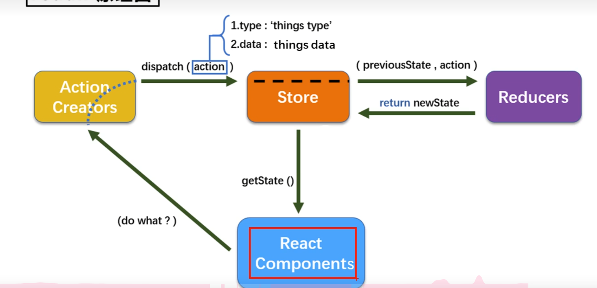

# redux

续 --react学习笔记

## 概念

redux 集中式状态管理仓库 包

可供vue、react、aulgular使用（常用于react）

蕾仕于VUEX




## 基本使用

``npm i redux``

官方文档

[入门 Redux | Redux 中文官网](https://cn.redux.js.org/introduction/getting-started)

[Getting Started with Redux | Redux](https://redux.js.org/introduction/getting-started)

```tsx
export default class Count extends Component<any, any, CountType>  {

    selectNumber = createRef<HTMLSelectElement>()
    increment = () => {
        const node = this.selectNumber.current;
        if (node) {
            store.dispatch(createIcmtAction(parseInt(node.value) * 1));
        }
    }

    decrement = () => {
        const node = this.selectNumber.current;
        if (node) {
            store.dispatch(createDcmtAction(parseInt(node.value) * 1));
        }
    }
    incrementIfOdd = () => {
        const node = this.selectNumber.current;
        const count = store.getState();
        console.log(count);
        if ((count % 2 != 0) && node) {
            store.dispatch(createIcmtAction(parseInt(node.value) * 1));
        }
    }
    asyncIncrement = () => {
        const node = this.selectNumber.current;
        if (node) {
            store.dispatch(createAsyncIcmtAction(parseInt(node.value) * 1, 500))
        }
    }

    render() {
        return (
            <div>
                <h1>当前求和：{store.getState()}</h1>
                <select ref={this.selectNumber}>
                    <option value="1">1</option>
                    <option value="2">2</option>
                    <option value="3">3</option>
                </select>
                <button onClick={() => this.increment()}>++</button>
                <button onClick={() => this.decrement()}>--</button>
                <button onClick={() => this.incrementIfOdd()}>odd++</button>
                <button onClick={() => this.asyncIncrement()}>async++</button>
            </div>
        )
    }
}
```

1. store.getState(), 获取该store的值

2. store.dispatch(), 通过action委派事件

3. action: 

   ```tsx
   import { INCREMENT, DECREMENT } from './constant'
   import { store } from './store'
   
   /**
    * 为Count生成action对象
   */
   // 同步action, 值action的值为Object类型的一般对象
   export const createIcmtAction = (data: number) =>
       ({ type: INCREMENT, data })
   export const createDcmtAction = (data: number) =>
       ({ type: DECREMENT, data })
   
   // 异步action, 值为function
   export const createAsyncIcmtAction = (data: number, time: number) => {
       return (dispatch: any) => {
           setTimeout(() => {
               dispatch(createIcmtAction(data))
           }, time)
       }
   }
   
   ```

4. store: 

   ```tsx
   // 引入redux
   import { applyMiddleware, createStore } from "redux";
   // 引入中间件
   import thunk from "redux-thunk";
   // 引入reducer
   import countReducer from './count_reducer'
   export const store = createStore(countReducer, applyMiddleware(thunk));
   ```

5. reducer

   ```tsx
   /**
    * 该文件创建count reducer
    * reducer会接受到两个参数：preState, action
    * 纯函数
    */
   import { AnyAction, Action } from 'redux'
   import { INCREMENT, DECREMENT } from './constant'
   // import { IAction } from "../type/action";
   
   const initState = 0;
   export default function countReducer(preState = initState, action: any) {
       const { type, data } = action;
       console.log(type);
       switch (type) {
           case INCREMENT:
               return preState + data // +
           case DECREMENT:
               return preState + - data // -
           default:    // 初始化
               return preState;
       }
   }
   ```

6. constant

   ```tsx
   export const INCREMENT = 'increment';
   export const DECREMENT = 'decrement';
   ```

7. store.subscribe：检测redux状态，发送修改时调用函数

   ```tsx
   store.subscribe(() => {
       // react diff算法，会避免dom大面积修改
       root.render(
           <React.StrictMode>
               <App />
           </React.StrictMode>
       )
   })
   ```

   

## react-redux

将react与redux完全分离

- UI组件：即不使用redux的react组件，只负责页面逻辑交互

- 容器组件：负责和redux通行，将结果返回给UI

  


=> react - connter - redux:

```tsx
const CountContainer = connect(mapStateToProps, mapDispatchToProps)(CountUI);

import { store } from './redux/store'
<Count store={store}></Count>
```


### eg

./container/Count/index.tsx

```tsx
// 容器组件
// 引入Count的UI组件
import CountUI from '../../components/Count'
import { createIcmtAction, createDcmtAction, createAsyncIcmtAction } from '../../redux/count_action'

// 引入connect用于连接UI组件与redux
import { connect, Connect, MapStateToProps, MapDispatchToProps } from 'react-redux'

// mapStateToProps是一个对象：key-value => props.key = value
// mapStateToProps用于传递对象
function mapStateToProps(state: MapStateToProps<any, any, any>) {
    return { count: state }
}

// mapDispatchToProps函数返回一个对象
// 传递方法
const mapDispatchToProps = (dispatch: MapDispatchToProps<any, any>) => {
    return {
        // 通知redux
        increment: (number: number) => {
            dispatch(createIcmtAction(number))
        },
        decrement: (number: number) => {
            dispatch(createDcmtAction(number))
        },
        asyncIcmt: (number: number, time: number) => {
            dispatch(createAsyncIcmtAction(number, time))
        }
    }
}

const CountContainer = connect(mapStateToProps, mapDispatchToProps)(CountUI);
export default CountContainer;

```

./App.tsx

```tsx
// 引入store, 用于连接store和容器组件
import { store } from './redux/store'

class App extends Component {
    render() {
        return (
            <Count store={store}></Count>
        )
    }
};

```


### 优化redux

#### 精简写法

```tsx
const mapStateToProps = (state: MapStateToProps<any, any, any>) => ({ count: state })
const mapDispatchToProps = () => {
    return {
        increment: createIcmtAction,
        decrement: createDcmtAction,
        asyncIcmt: createAsyncIcmtAction
    }
}
const CountContainer = connect(mapStateToProps, mapDispatchToProps())(Count);
```

mapD ispatchToProps，可直接传入对象

#### container自动检测redux & Provider

```tsx
无需使用store.subscribe(()=>{})

使用Provider组件，给子组件传递store
import { Provider } from "react-redux"; 
<Provider store={store}>
    <Count></Count>
</Provider>
```

### store间数据通信

```tsx
// 汇总reducer
const allReducer = combineReducers({
    count: countReducer,
    person: personReducer
})
export const store = createStore(allReducer, composeWithDevTools(applyMiddleware(thunk)));

```


### 纯函数

- 一类特别函数：同样的实参 => 必定有相同的结果
- 遵循约束：
  - 不得改写参数数据
  - 不会产生任何副作用
  - 不能调用Date.now()等不纯方法

redux的reducer函数必须是纯函数

[Pure function - Wikipedia](https://en.wikipedia.org/wiki/Pure_function)

**纯函数是指在函数的执行过程中，不会对程序的状态进行任何改变，也不会对外部环境产生任何副作用，即只依赖于其输入参数，而不依赖于任何外部变量或状态的函数**。

### redux开发调试插件

npm i redux-devtools-extension

```tsx
import { composeWithDevTools } from 'redux-devtools-extension'

export const store = createStore(allReducer, composeWithDevTools(applyMiddleware(thunk)));
```


## reduxjs/toolkit


