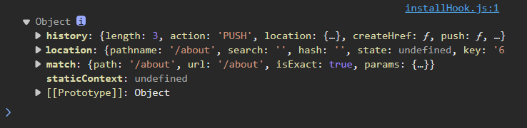

# react学习笔记

续

## react路由

对于SPA（simple page application）使用

页面的局部更新。

路由：进行对``key(path)--value(func / component)``的映射

### 分类

- 后端路由

  value为func，用来处理客户端提交的请求

  router.get(path, func)

- 前端路由

### 前端路由基石_history

在BOM（Browser object model）

可使用对bom.history（源api不方便 ）封装库，记录应该tabpage的url变化

push/replace。

模式：history / hash

### react库&基本使用

react-router ：

- web
- native
- any

[React Router: Declarative Routing for React.js](https://v5.reactrouter.com/web/guides/quick-start)

（web）使用react-router-dom@5：``npm i react-router-dom@5``


使用：

```tsx
import React, { Component } from 'react'
import { Link, BrowserRouter, Route } from 'react-router-dom'

import About from '../../view/About'
import Home from '../../view/Home'
// import './index.css'


export default class index extends Component {
  render() {
    return (
      <BrowserRouter>
        <div id="root">
          <div>
            <div className="row">
              <div className="col-xs-offset-2 col-xs-8">
                <div className="page-header"><h2>React Router Demo</h2></div>
              </div>
            </div>
            <div className="row">
              <div className="col-xs-2 col-xs-offset-2">
                <div className="list-group">
                  {/* 原生html跳转 */}
                  {/* <a className="list-group-item" href="./about.html">About</a>
                                <a className="list-group-item active" href="./home.html">Home</a> */}

                  {/* 在React中靠路由链接实现组件 */}
                  <Link className="list-group-item" to='/home'>Home</Link>
                  <Link className="list-group-item" to="/about">About</Link>
                </div>
              </div>
              <div className="col-xs-6">
                <div className="panel">
                  <div className="panel-body">
                      {/* 组测路由 */}
                      <Route path="/about" component={About} />
                      <Route path="/home" component={Home} />
                  </div>
                </div>
              </div>
            </div>
          </div>
        </div>
      </BrowserRouter>
    )
  }
}

```


路由组件与一般组件

路由组件prop



```tsx
{
    "history": {
        "length": 4,
        "action": "PUSH",
        "location": {
            "go",
            "goBack",
            "goForward"
            "pathname": "/home",
            "search": "",
            "hash": "",
            "key": "g81ugq"
        }
    },
    "location": {
        "pathname": "/about",
        "search": "",
        "hash": "",
        "state": undefined
    },
    "match": {
        "path": "/about",
        "url": "/about",
        "isExact": true,
        "params": {}
    }
}
```

### NavLink

当激活该路由时，自动加上指定(默认active)类

```tsx
<Link className="list-group-item" to='/home'>Home</Link>
<Link className="list-group-item" to="/about">About</Link>

<NavLink activeClassName='active' className="list-group-item" to='/home'>Home</NavLink>
<NavLink activeClassName='active' className="list-group-item" to='/about'>About</NavLink>
```

建议封装

```tsx
使用了类似于插槽的东西。

<MyNavLink to="/home">Home</MyNavLink>
<MyNavLink to="/about">About</MyNavLink>

import React, { Component } from 'react'
import { NavLink } from 'react-router-dom'

// MyNavLink
export default class MyNavLink extends Component<MyNavLinkProps> {
    render() {
        console.log(this);
        return (
            <NavLink activeClassName='active' className="list-group-item" {...this.props}/>
        )
    }
}

this.props中有特殊的属性：children，可获取组件标签标签体内容
```

### Switch使用

当使用Switch时，遵循就近原则，匹配到的一个组件渲染

默认是都遍历完，就远原则

```tsx
  <div className="panel-body">
    <Switch>
      {/* 组测路由 */}
      <Route path="/about" component={About} />
      <Route path="/home" component={Home} />
      <Route path="/home" component={Test}></Route>
    </Switch>
  </div>
```

### 多级页面静态资源文件丢失问题

1. public/xxx 中 引入的静态文件使用绝对路径
2. public/xxx 使用`%PUBLIC_URL%/`指向文件
3. 使用hash路由（#后的加载文件会认为是前端资源）

原因：

```
url：xxx/x1/x2

强制刷新后，倘若静态文件file1是使用相对路径 => 那么这个文件的请求将会是xxx/x1/x2/file1
```

### 模糊匹配 & 精准匹配

一般不使用精准匹配

```tsx
 <div className="col-xs-2 col-xs-offset-2">
    <div className="list-group">
      {/* 二次封装 */}
      {/* 标签体内容是特殊的标签属性 */}
      <MyNavLink to="/joshua/home">Home</MyNavLink>
      <MyNavLink to="/joshua/about/abc">About</MyNavLink>
    </div>
  </div>
  <div className="col-xs-6">
    <div className="panel">
      <div className="panel-body">
        {/* 注册路由 */}
        <Switch>
          <Route path="/joshua/about" component={About} />
          <Route exact={true} path="/joshua/home" component={Home} />
          <Route exact path="/joshua/home" component={Test}></Route>
        </Switch>
      </div>
    </div>
  </div>

exact开启严格匹配，跳转的路由与注册的路由必须一致
默认模糊，前缀一致
```

### 重定向问题：

```tsx
  <div className="panel-body">
    {/* 注册路由 */}
    <Switch>
      <Route path="/joshua/about" component={About} />
      <Route exact={true} path="/joshua/home" component={Home} />
      <Route exact path="/joshua/home" component={Test}></Route>

      <Redirect to="/joshua/home/"></Redirect>
    </Switch>
  </div>
当都匹配不到时，重定向
```

### 嵌套路由

在home组件中再嵌套路由（二级路由）

```tsx
  <div>
    <h2>Home组件内容</h2>
    <div>
      <ul className="nav nav-tabs">
        <li>
          <MyNavLink to="/home/messages">Messages</MyNavLink>
        </li>
        <li>
          <MyNavLink to="/home/news">News</MyNavLink>
        </li>
      </ul>
      <div>
        {/* 注册路由 */}
        <Switch>
          <Route path="/home/news" component={News}></Route>
          <Route path="/home/messages" component={Message}></Route>
          <Redirect to="/home/messages"></Redirect>
        </Switch>
      </div>
    </div>
  </div>
```

注意路由路径 => 不能随便使用精确模式的route


### 路由传参

1. params

   ```tsx
   {/* 向路由传递params参数 */}
   <Link to={`/home/messages/detail/${item.id}/`}>{item.title}</Link>
   
   {/* 组测路由 */}
   {/* 携带params参数 */}
   <Route path="/home/messages/detail/:id/" component={Detail}></Route>
   ```

2. search

   ```tsx
   {/* 向路由传递search参数 */}
   <Link to={`/home/messages/detail/?id=${item.id}&title=${item.title}/`}>{item.title}</Link>
   
   {/* search参数无需声明接受 */}
   <Route path="/home/messages/detail" component={Detail}></Route>
   
   urlencode正则匹配
   parse = (search: string) => {
           const searchParams: { [key: string]: string } = {};
           const regex = /[?&]([^=]+)=([^&]*)/g;
   
           search = search[search.length - 1] === '/' ? search.slice(0, -1) : search;
           let match;
           while ((match = regex.exec(search))) {
               const key = decodeURIComponent(match[1]);
               const value = decodeURIComponent(match[2]);
               searchParams[key] = value;
           }
           return searchParams;
       }
   
   ```

   

3. state传参

   ```tsx
   {/* 向路由传递state参数 */}
   <Link to={{ pathname: '/home/messages/detail/', state: { id: item.id } }}>{item.title}</Link>
   
   {/* 无需声明接受 */}
   <Route path="/home/messages/detail" component={Detail}></Route>
   ```

ts支持

```tsx
import { RouteComponentProps, StaticRouter } from "react-router-dom";


interface DetailProps extends RouteComponentProps<RouterParams, IStaticContext,  RouterLocation> {
}
interface RouterParams {
    id: string
}
interface IStaticContext extends StaticRouter{
}
interface RouterLocation {
    id: string
}

```


路由跳转

1. replace

   替换当前历史栈顶记录

2. push（stack）

   push浏览历史记录

### 编程式路由

```tsx
  replaceShow = (id: string) => {
    // params/search类似
    // this.props.history.replace(`/home/messages/detail/${id}`)

    // state
    this.props.history.replace(`/home/messages/detail/`, { id })
  }
  pushShow = (id: string) => {
    this.props.history.push(`/home/messages/detail/`, { id })
  }

  forward = () => {
    this.props.history.goForward()
  }
  back = () => {
    this.props.history.goBack()
  }
  go = () => {
    let n = -2;
    this.props.history.go(n)
  } 


<Link to={`/home/messages/detail/${item.id}/`}>{item.title}</Link>
  &nbsp;<button onClick={()=>this.replaceShow(item.id)}>replace</button>
  &nbsp;<button onClick={()=>this.pushShow(item.id)}>push</button> 

  <Link to={{ pathname: '/home/messages/detail/', state: { id: item.id } }}>{item.title}</Link>
  &nbsp;<button onClick={() => this.replaceShow(item.id)}>replace</button>
  &nbsp;<button onClick={() => this.pushShow(item.id)}>push</button>

  forward = () => {
    this.props.history.goForward()
  }
  back = () => {
    this.props.history.goBack()
  }
  go = () => {
    let n = -2;
    this.props.history.go(n)
  }
```

### withRouter

让非路由组件应用router的api

```tsx
import React, { Component } from 'react'
import { RouteComponentProps, withRouter } from 'react-router-dom'

class Header extends Component<RouteComponentProps> {
    back = () => {
        this.props.history.goBack()
    }
    render() {
        return (
            <div className="row">
                <div className="col-xs-offset-2 col-xs-8">
                    <div className="page-header"><h2>React Router Demo</h2></div>
                </div>
                <button onClick={() => this.back()}>back</button>
            </div>
        )
    }
}

export default withRouter(Header)
```

### BrowserRouter 与 HashRouter

1. 底层实现：

   BrowerRouter使用的是H5的history API， 

   HashRouter使用urlhash值

2. path：hash => ‘#’

3. 刷新后HashRouter刷新后，state数据会丢失

