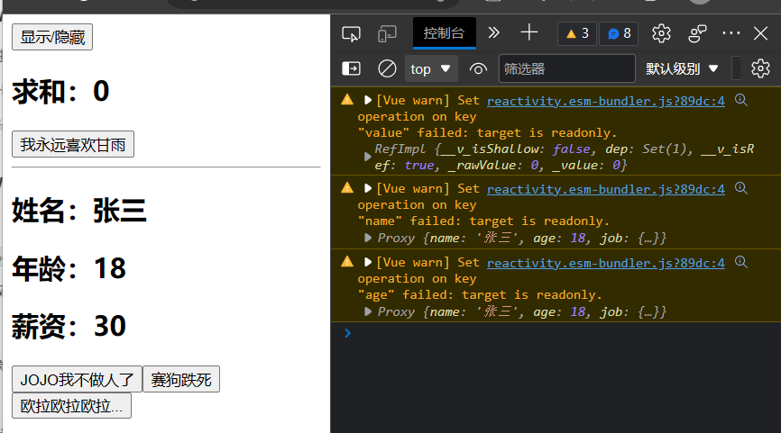
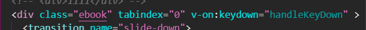

# 1. Vue3

<!-- TOC -->

- [1. Vue3](#1-vue3)
  - [1.1. 一. Vue3 cli基本介绍](#11-一-vue3-cli基本介绍)
  - [1.2. 二. 常用Composition API](#12-二-常用composition-api)
    - [1.2.1. 拉开序幕的setup](#121-拉开序幕的setup)
    - [1.2.2. ref 函数--基本处理类型](#122-ref-函数--基本处理类型)
    - [1.2.3. reactive函数](#123-reactive函数)
    - [1.2.4. Vue3.0中响应式原理](#124-vue30中响应式原理)
      - [1.2.4.1. vue3.0\&vue2.x实现响应式](#1241-vue30vue2x实现响应式)
      - [基本原理：](#基本原理)
    - [1.2.5. ref与reactive](#125-ref与reactive)
    - [1.2.6. setup注意点](#126-setup注意点)
    - [1.2.7. computed计算属性](#127-computed计算属性)
    - [1.2.8. watch监视数据](#128-watch监视数据)
    - [1.2.9. Vue3.0生命周期钩子](#129-vue30生命周期钩子)
    - [1.2.10. 自定义hook](#1210-自定义hook)
    - [1.2.11. toRef](#1211-toref)
  - [1.3. 三. 常用Composition API](#13-三-常用composition-api)
    - [1.3.1. shallowReactive \& shallowRef](#131-shallowreactive--shallowref)
    - [1.3.2. readonly \& shallowReadonly](#132-readonly--shallowreadonly)
    - [1.3.3. toRaw \& markRaw](#133-toraw--markraw)
    - [1.3.4. customRef](#134-customref)
    - [1.3.5. provide \& inject](#135-provide--inject)
    - [1.3.6. 响应式数据的判断](#136-响应式数据的判断)
  - [1.4. 四、新的组件](#14-四新的组件)
    - [1.4.1. Fragment](#141-fragment)
    - [1.4.2. Teleport](#142-teleport)
    - [1.4.3. Suspense](#143-suspense)
  - [1.5. 六、其他](#15-六其他)
    - [1.5.1. 全局API的转移](#151-全局api的转移)
    - [1.5.2. 其他改变](#152-其他改变)
  - [1.6. Vue3路由：](#16-vue3路由)

<!-- /TOC -->

官方文档: https://v3.cn.vuejs.org/guide/composition-api-introduction.html

## 1.1. 一. Vue3 cli基本介绍

**main.js：**

```javascript
//这里写法不再与vue2相同
//引入createApp的工厂函数
import { createApp } from 'vue'
import App from './App.vue'

//创建应用实例对象--app对象(类似与vue2的vm，但app比vm更轻)
createApp(App).mount('#app')
// const app=createApp(App)
// app.mount('#app')
// console.log(app)

//vue2：main.js
new Vue({
    render:(h)=>{return h(App)}//->render:h=>h(App)
}).$mount('#app')
```

**App.vue:**

```html
<template>
  
  <HelloWorld msg="Welcome to Your Vue.js App"/>
</template>
//不需要根标签
```

## 1.2. 二. 常用Composition API

### 1.2.1. 拉开序幕的setup

-- Vue3没有setup，就如同西方没有了耶路撒冷那般。

1. 理解：vue3的新配置项

2. 组件中用到的：数据、方法等等，均要配置在setup上

3. setup返回值

   1. 返回对象（属性、方法），在模板中直接使用。（重点关注）

   2. 返回渲染函数，可自定义渲染内容

      ```javascript
      setup{
          import {h} from 'vue'
          ...
          return ()=>{return h('h1','我永远喜欢甘雨')}
          //return ()=>h('h1','我永远喜欢甘雨')
          //直接使用渲染函数h对标签（h1...）的更改内容
      }
      ```

4. 注意

   1. 尽量不与vue2配置混用：
      - vue2.x配置中可访问到setup数据
      - setup不能使用vue2.x配置的数据
      - vue2.x与setup有配置属性有重名 -> setup优先
   2. setup不能是个async函数，因为返回值不再是return对象，而是promise，模板看不到return对象的属性（但是，如果是动态（异步）组件，返回一个Promise实例，但需要Suspense和异步组件配合）

### 1.2.2. ref 函数--基本处理类型

1. 使得setup的变量属性可以**响应**修改（响应式/setter、getter）

   ```javascript
   //使用相应的属性...在<template>里
   <h2>名字：{{ name }}</h2>
   <h2>年龄：{{ age }}</h2>
   
   //引入
   import {ref} from 'vue'
   
   setup(){
       let name = ref('甘雨')
       let age = ref(18)
       function changeName(){
         name.value = '胡桃'
         age.value = 16
         console.log(name,age)
       }
       return {
         name,
         age,
         changeName,
       }
     }
   
   当触发changeName时，页面将会响应变化（相当于添加了setter和getter）
   ```

2. 由ref赋值后的变量为一个**RefImpl**对象（reference，引用、implement，实现），在原型上具有setter、getter函数，很像vue2的_data。

3. 当数据类型为对象时，会调用vue3的一个函数--reactive函数实现响应式（使用了es6的proxy）


### 1.2.3. reactive函数

不能用于普通数据类型（面向对象？）

- 作用：使引用数据类型具有响应式特性
- const ``代理对象`` = reactive(源对象) -> (返回代理对象（Proxy对象）)
- 内部基于es6的Proxy实现的 

```javascript
let var_obj=reactive({
    var1:'',
    var2:'',
    ...
})
let var_array=reactive(['...','...',...])

function changeInfo(){
    name.value='',
    var_obj.var1='',
    var_array[x]='',
    //通过reactive，使得引用数据类型不需要.value来实现响应式
}
```

### 1.2.4. Vue3.0中响应式原理

#### 1.2.4.1. vue3.0&vue2.x实现响应式

1. vue2.x 响应式地添加&删除数据（需要手动调用set/delete函数，否则页面无法响应式）

   ```javascript
   //html:
   <div>
       <div v-show="person.name">{{ person.name }}</div>
       <div>{{ person.age }}</div>
       <div v-show="person.sex">{{ person.sex }}</div>
       <button @click="addSex">点击显示性别</button>
       <button @click="removeName">点击删除姓名</button>
    </div>
   
   //vue-script:
   <script>
   import vue from 'vue'
   export default {
       name:'App',
       data(){
           return{
               person:{
                   name: "法外狂徒--张三",
                   age: 17,
               }
               // name:"张三",
           }
       },
       methods:{
           addSex(){
               // this.person.sex='母鸡'
               // console.log(this.person.sex)
               // 虽然已经添加person.sex，但是并没有实现setter/getter，从而无法响应式
               this.$set(this.person,'sex','母鸡')
               // vue.set(this.person,'sex','母鸡')
           },
           removeName(){
               //这里仍然需要借组vue2的函数实现删除操作
               this.$delete(this.person,'name')
               // vue.delete(this.person,'name')
           }
       }
   }
   </script>
   ```

2. vue3.0 使用reactive后，可在自定义方法（函数）上直接修改/添加/删除等操作，实现响应式

   ```javascript
   import {reactive} from 'vue'
   export default {
     name: 'App',
     setup(){
       let person = reactive({
         name:'张三',
         age: 18,
         hobby: ['抽烟','喝酒','烫头'],
       })
       
   
       function changeName(){
         person.name='李四'
       }
   
       function addSex(){
         person.sex='女'
       }
   
       function deleteName(){
         delete person.name
       }
   
       return {
         person,
         changeName,
         addSex,
         deleteName,
       }
     }
   }
   ```

   #### 基本原理：

   Vue3.0通过**es6**的代理``Proxy``和``Reflect``（采用了es6的``Reflect``而非原生的``Object``）实现了响应式:

   - 通过``Proxy``（代理）:  拦截对象中任意属性的变化, 包括：属性值的读写、属性的添加、属性的删除等。
   - 通过``Reflect``（反射）:  对源对象的属性进行操作。
   - MDN文档中描述的Proxy与Reflect：
     - Proxy：https://developer.mozilla.org/zh-CN/docs/Web/JavaScript/Reference/Global_Objects/Proxy

     - Reflect：https://developer.mozilla.org/zh-CN/docs/Web/JavaScript/Reference/Global_Objects/Reflect

   ```javascript
       let person={
           name:'张三',
           age:18
       }
       //模拟vue2中实现响应式
       //使用p对象实现响应式
       //删除/添加属性都不是很方便
        let p={}
        Object.defineProperty(p,'name',{
            configurable:true,
            get(){
                return person.name
            },
            set(value){
                console.log('修改了name属性')
                person.name=value
            }
        })
        Object.defineProperty(p,'age',{
            configurable:true,
            get(){
                return person.name
            },
            set(value){
                console.log('修改了age属性')
                person.age=value
            }
        })
   
       //模拟vue3的响应式
       // Proxy:代理
       //target-> person对象，
       //不写 get、set、deleteProperty
       //采用Proxy和Reflect实现响应式 -> 原因下面有说明
       const p=new Proxy(person,{
           //读取
           get(target,propName){
               console.log(`读取了属性${propName}`)
               // return target[propName];
               return Reflect.get(target,propName);
           },
           //添加/修改
           set(target,propName,value){
               console.log(`修改了属性${propName}`)
               // target[proName]=value;
               Reflect.set(target,proName,value)
           },
           //删除
           deleteProperty(target,propName){
               console.log(`删除了属性${propName}`)
               // return delete target[propName]
               return Reflect.deleteProperty(target,propName)
               //删除成功 返回true，反之返回false
           }
       })
   
       
       let obj={a:1,b:2}
       //通过Object.defineProperty操作
       // Object.defineProperty(obj,'c',{
       //     get(){
       //         return 3;
       //     }
       // })
       // Object.defineProperty(obj,'c',{
       //     get(){
       //         return 4;
       //     }
       // })
       //这里将因为重复定义'c'属性而报错,倒是整个网页不运行
   
       //通过Reflect.defineProperty操作
       const x1=Reflect.defineProperty(obj,'c',{
           get(){
               return 3;
           }
       })
       console.log(x1)
       const x2=Reflect.defineProperty(obj,'c',{
           get(){
               return 4;
           }
       })
       console.log(x2)
       //这里的返回值为boolean，x2==false，表示对于已经声明的属性c，无法再次声明而失败
       //便于框架的统一封装，如果因为报错而停止运行，这将是非常麻烦的事情
       //简单的讲就是不用写太多try...catch... reactive 与 ref
   ```

   

### 1.2.5. ref与reactive

1. 定义数据类型：
   - ref：基本数据类型
   - reactive：引用数据类型（对象、数组）
   - 注：ref也可以定义对象、数组数据类型，内部会自动通过reactive转为代理对象
2. 原理：
   - **ref**通过``Object.defineProperty()``实现数据劫持
   - **reactive**通过``Proxy``实现数据劫持、通过``Reflect``操作**源对象**（不是代理数据）内部数据
3. 使用角度： **ref**对数据进行操作``.value``，**reactive**不需要


### 1.2.6. setup注意点

1. **vue2**的props、插槽

   ```javascript
   ./App.vue:
   
   <template>
       <div class="app">
           <div>
               Vue2
           </div>
           <Demo msg1="你是傻逼吧" msg2="你是猪吧">
               <span>我永远喜欢甘雨</span>
               <template slot="demo1">
                   <span>我最喜欢甘雨了</span>
               </template>
           </Demo>
       </div>
   </template>
   
   <script>
   import Demo from './components/Demo.vue'
   export default {
       name:'App',
       components:{Demo}
   }
   </script>
   
   <style>.app{background: gray;padding:10px;}</style>
   
   ./components/Demo.vue:
   <template>
     <div class="Demo">
       Demo组件
       <div>
           {{ msg1 }}
           {{ $attrs.msg2 }}
           <!-- 父组件传数据，不在props声明,就在$attrs上  -->
       </div>
       <!-- 存在vc对象中的$slots对象里 虚拟dom->转化为真实dom-->
       <slot></slot>
       <!-- 默认插槽 -->
       <br>
       <slot name="demo1"></slot>
       <!-- 具名插槽 -->
     </div>
   </template>
   
   <script>
   export default {
       name:'Demo',
       props:['msg1'],
   }
   </script>
   
   <style>.Demo{background: orange;padding: 10px;}</style>
   ```

2. **Vue3.0**中setup的声明比生命钩子beforeCreated()还早

3. setup参数：``setup(props,context)``

   - props：值为对象，包含：组件外部传递过来，且组件内部声明接收了的属性。
   - context(上下文对象)
     - attrs
     - slots
     - emit

### 1.2.7. computed计算属性

```javascript
//vue2写法
computed:{
    fullName(){
        return this.person.firstName+'-'+this.person.secondName
    }
},
        
//vue3.0简写
person.fullName=computed(()=>{
    return person.firstName+'-'+person.secondName
})
//完整写法
person.fullName=computed({
    get(){
        return person.firstName+'-'+person.secondName
    },
    set(value){
        const nameArr=value.split('-')
        person.firstName=nameArr[0]
        person.secondName=nameArr[1]
    }
})

//编程函数化？
```


### 1.2.8. watch监视数据

0. **配置属性**

   ```javascript
   let sum=ref(0)
   let msg=ref('我永远喜欢甘雨')
   let person=reactive({
       name:'张三',
       age:18,
       job:{
           j1:{
               salary:20
           }
       }
   })
   ```

   

1. **Vue2.x** ``watch()``监测数据：

   ```javascript
   watch:{
       // sum(newValue,oldValue){
       //     console.log('我永远喜欢甘雨',newValue,oldValue)
       // }//简写
       sum:{
           immediate:true,//初始化就监视
           deep:true,//深度监视
           handler(newValue,oldValue){
               console.log('我永远喜欢甘雨',newValue,oldValue)
           }
       }
   },
   ```

2. **Vue3** 监测ref数据

   ```javascript
   //1. 只监测一个数据
   watch(sum,(newValue,oldValue)=>{
       console.log("监测sum数据",newValue,oldValue)
   },{immediate:true})
   watch(msg,(newValue,oldValue)=>{
       console.log('监测msg',newValue,oldValue)
   })
   // 目前deep配置项有点小问题
   
   
   //2. 监测多个数据(数据多?)
   watch([sum,msg],(newValue,oldValue)=>{
       console.log("监测msg和sum",newValue,oldValue)
   })
   ```

3. **Vue3** 监测reactive数据

   有坑（或bug）：

   - 监测reactive定义的响应式数据时：oldValue无法正确获取，并强制开启深度监视（deep配置失败）
   - 监测reactive定义的响应式数据时中的某个属性时，deep配置有效

   ```javascript
   //监测reactive数据
   //3.直接监测reactive所定义的一个响应式数据的全部属性
   //(i)  无法准确获取oldValue
   //(ii) deep深度监视被前置开启（严格讲，deep配置无效）
   //或许是bug，目前没解决整个问题
   watch(person,(newValue,oldValue)=>{
       console.log('person变化了',newValue,oldValue)
   },{deep:false})
   
   //4. 监视reactive所定义的一个响应式数据中的某个属性
   //需要写箭头函数，返回对应属性的返回值
   // //可正确返回oldValue值
   watch(()=>person.name,(newValue,oldValue)=>{
       console.log('person.name变化',newValue,oldValue)
   })
   watch(()=>person.age,(newValue,oldValue)=>{
       console.log('person.age变化',newValue,oldValue)
   })
   
   //5. 一次监测多个数据（虽然很浪费资源）
   watch(()=>[person.name,person.age],(newValue,oldValue)=>{
       console.log('person.name或person.age变化',newValue,oldValue)
   })
   
   //特殊情况
   //deep深度监测配置有效，但是所监测的值仍不能正确获取oldValue
   watch(()=>person.job,(newValue,oldValue)=>{
       console.log('person的job变化',newValue,oldValue)
   },{deep:true})
   ```

   **注意点：**

   ref所定义的数据类型为对象时，.value的值为Proxy对象，本身是可被监测的，直接监测ref所定义的对象类型反而无法监测到.value的Proxy对象(如果不开深度监测的话)

   ```javascript
   setup(){
           let sum=ref(0)
           let msg=ref('我永远喜欢甘雨')
           let person=ref({
               name:'张三',
               age:18,
               job:{
                   j1:{
                       salary:20
                   }
               }
           })
           watch(sum,(newValue,oldValue)=>{
               console.log("sum变化",newValue,oldValue)
           })//这里不能.value
       
           watch(person,(newValue,oldValue)=>{
               console.log("不开deep深度监测,person监测不到变化",newValue,oldValue)
           })
       
           watch(person.value,(newValue,oldValue)=>{
               console.log("可监测person.value(即.value的Proxy对象)",newValue,oldValue)
           })
       
           watch(person,(newValue,oldValue)=>{
               console.log("开启deep深度监测,可监测到person的变化",newValue,oldValue)
           },{deep:true})
       
           return {
               sum,
               msg,
               person,
           }
       },
   ```

4. watchEffect函数

   - watch：监视的属性具体信息，指明监视的回调
   - watchEffect：不需要指明所监视的属性，只监视所在改函数的属性的回调。
   - watchEffect与computed有点像（回调函数的返回值），watchEffect注重过程，不需要写返回值。

   ```javascript
   let sum=ref(0)
   let msg=ref('我永远喜欢甘雨')
   let person=ref({
       name:'张三',
       age:18,
       job:{
           j1:{
               salary:20
           }
       }
   })
   
   watchEffect(()=>{
       const x1=sum.value;
       const x2=person.value.job.j1.salary;
       console.log("watchEffect配置回调执行")
   })
   ```

   

### 1.2.9. Vue3.0生命周期钩子


变化：

- Vue3.0中可以继续使用Vue2.x中的生命周期钩子，但有有两个被更名：
  - ```beforeDestroy```改名为 ```beforeUnmount```
  - ```destroyed```改名为 ```unmounted```
- Vue3.0也提供了 Composition API 形式的生命周期钩子，与Vue2.x中钩子对应关系如下：
  - `beforeCreate`===>`setup()`
  - `created`=======>`setup()`
  - `beforeMount` ===>`onBeforeMount`
  - `mounted`=======>`onMounted`
  - `beforeUpdate`===>`onBeforeUpdate`
  - `updated` =======>`onUpdated`
  - `beforeUnmount` ==>`onBeforeUnmount`
  - `unmounted` =====>`onUnmounted`

1. 作为配置项（即写在setup外）

   ```javascript
   beforeCreate(){
       console.log("--------beforeCreate--------")
   },
   created(){
       console.log("--------Create--------")
   },
   beforeMount(){
       console.log("--------beforeMount--------")
   },
   mounted(){
       console.log("--------mounted--------")
   },
   beforeUpdate(){
       console.log("--------beforeUpdated--------")
   },
   updated(){
       console.log("--------updated--------")
   },
   beforeUnmount(){
       console.log("--------beforeUnmount--------")
   },
   unmounted(){
       console.log("--------Unmounted--------")
   }
   ```

2. setup内，组合式API

   ```javascript
   import {ref,onBeforeMount,onMounted,onBeforeUpdate,onUpdated,onBeforeUnmount,onUnmounted} from 'vue'
   ....
   setup(){
       let sum=ref(0)
       onBeforeMount(()=>{
           console.log("-----------onBeforeMount------------")
       })
       onMounted(()=>{
           console.log("------------onMounted-----------")
       })
       onBeforeUpdate(()=>{
           console.log("------------onBeforeUpdate-----------")
       })
       onUpdated(()=>{
           console.log("------------onUpdated-----------")
       })
       onBeforeUnmount(()=>{
           console.log("-----------onBeforeUnmount------------")
       })
       onUnmounted(()=>{
           console.log("------------onUnmounted-----------")
       })
       return {
           sum,
       }
   }
   ```

   

### 1.2.10. 自定义hook

1. hook本质上就是封装好了的api函数
2. 类似于vue2.x中的mixin
3. 提高代码复用率

```javascript
//在hooks/xxx.js文件中：
import {reactive,onMounted,onBeforeUnmount} from 'vue'

function savePoint(){
    let point=reactive({
        x:0,
        y:0
    })

    function savePoint(event){
        point.x=event.pageX
        point.y=event.pageY
        console.log(event.pageX,event.pageY)
    }
    onMounted(()=>{
        //window.addEventListener(事件，回调)
        window.addEventListener('click',savePoint)
    })
    onBeforeUnmount(()=>{
        //window.removeEventListener(事件，回调)
        window.removeEventListener('click',savePoint)
    })

    //作为函数钩子的返回值
    return point;
}

export default savePoint
```

### 1.2.11. toRef

- 作用：创建一个ref对象，其值指向另一个对象中的某个属性（类似于指针）
- ``const name=toRef(persin,'name')``
- 应用：要将响应式某个属性单独提供外部使用
- **toRefs**：批量创建ref对象


## 1.3. 三. 常用Composition API

### 1.3.1. shallowReactive & shallowRef

- shallowReactive：只处理对象最外层属性响应式

- shallowRef：只实现基本数据类型的响应式，不进行对象的响应式处理

  （.value为Object对象，而不是Proxy对象）

- 使用时机：

  - 只需要监测最外层属性变化 ===> shallowReactive
  - 后续功能中不修改对象属性 ===> shalloRef

### 1.3.2. readonly & shallowReadonly

- readonly：让一个响应式数据变为只读（深只读）
- shallowReadonly：对于对象数据类型，只只读第一层数据
- 应用：当不希望数据被修改。对于只读数据，修改时，会警告并阻止数据修改



### 1.3.3. toRaw & markRaw

- toRaw:
  返回reactive所生成的响应式对象的一个普通对象（不具有响应式）
- markRaw:
  - 标记对象，使该对象不具备响应式
  - 使用：
    1. 第三方库  
    2. 渲染不可变数据源的大列表（提高性能） 

### 1.3.4. customRef

- 作用：创建一个自定义ref，并对其依赖项跟踪和更新触发进行显示控制

- 实现防抖效果：

  ```javascript
  <template>
      <br>
      <input type="text" v-model="keyword">
      <h2>{{ keyword }}</h2>
  </template>
    
  <script>
  import {ref,customRef} from 'vue'
  export default {
      name: 'Demo',
      setup(){
  
          function myRef(value,delay){
              let timer
              return customRef((track,trigger)=>{
                  return {
                      get(){
                          console.log(`从myRef中读取数据,${value}`)
                          track()//追踪数据变化，当数据变化时，重新读取
                          return value
                      },
                      set(newValue){
                          console.log(`修改数据,${value}`)
                          value=newValue
                          clearTimeout(timer)//防抖，输入完再解析模板
                          timer=setTimeout(()=>{
                              value=newValue
                              trigger()//使vue重新解析模板
                          },delay)
                      }
                  }
              })
          }
  
          let keyword=myRef('hello',250)
          return {
              keyword
          }
      },
  }
  </script>
  ```

  

### 1.3.5. provide & inject

实现祖孙之间数据传递：


父组件使用``provide``提供数据包，子组件使用``inject``使用数据

（一般父子关系的直接使用props即可）

1. 祖组件：

   ```javascript
   setup(){
       let car=reactive({'车名':'宝马','价格':114514})
       provide('car',car)
       //provide('varName',var)
   },
   ```

2. 子组件：

   ```javascript
   setup(){
       const car=inject('car')
       return{car}
   }
   ```


### 1.3.6. 响应式数据的判断

- isRef：是否为``ref``对象
- isReactive：是否为``reactive``创建响应式代理
- isReadonly：是否为``readonly``创建的只读代理
- isProxy：检查对象是否由``reactive``或``readonly``方法创建的代理


## 1.4. 四、新的组件

### 1.4.1. Fragment

- Vue2中，组件必须有一个根标签
- Vue3中，组件没有根标签，但内部将有多个标签，包含在Fragment虚拟元素中
- 减少标签层级，减小内存占用


### 1.4.2. Teleport  

``Teleport``（传送），一种能够将组件html结构传送到指定位置的技术

子组件：

```html
//弹窗
<template>
  <div>
    <button @click="isShow=true">点我弹个窗</button>
    <teleport to='body'> //id选择器也行
    <div v-if="isShow" class="mask">
    <div class="dialog">
        <h3>我是傻逼</h3>
        <h4>哦</h4>
        <h4>哦</h4>
        <button @click="isShow=false">关闭弹窗</button>
    </div>
    </div>
    </teleport>
  </div>
</template>
<style>
.mask{
    position: absolute;
    top: 0;bottom: 0;left: 0;right: 0;
    background-color: rgba(0,0,0,0.5);
}
.dialog{
    position: absolute;
    top:50%;
    left: 50%;
    transform: translate(-50%,-50%);
    width: 300px;
    height: 300px;
    text-align: center;
    background: pink;
    border-radius: 50px;
}
</style>
```


### 1.4.3. Suspense

等待异步组件渲染时，显示另外加载的内容

使用步骤：

- 异步引入组件：

  ```javascript
  import {defineAsyncComponent} from 'vue'
  const Child = defineAsyncComponent(()=>import('./components/Child.vue'))
  
  1. 
  setup(){
      return new Promise((resolve,reject)=>{
          setTimeout(()=>{
              resolve({sum})
          },3000)
      })
  }
  2. 
  async setup(){
    let sum=ref(0)
    let p = new Promise((resolve,reject)=>{
      setTimeout(()=>{
        resolve({sum})
      },3000)
    })
    return await p
  }
  ```

- 使用``Suspense``包裹组件，并配置好``default``和``fallback``

  ```javascript
  <template>
    <div class="app">
      祖组件
      <Suspense>
        <template v-slot:default>
          <Child></Child>
        </template>
        <template v-slot:fallback>
          <h3>加载ing...</h3>
        </template>
      </Suspense>
      <!-- <Child /> -->
    </div>
  </template>
  
  //通过插槽实现
  ```

## 1.5. 六、其他

### 1.5.1. 全局API的转移

- Vue 2.x 有许多全局 API 和配置。

  - 例如：注册全局组件、注册全局指令等。

    ```js
    //注册全局组件
    Vue.component('MyButton', {
      data: () => ({
        count: 0
      }),
      template: '<button @click="count++">Clicked {{ count }} times.</button>'
    })
    
    //注册全局指令
    Vue.directive('focus', {
      inserted: el => el.focus()
    }
    ```

- Vue3.0中对这些API做出了调整：

  - 将全局的API，即：```Vue.xxx```调整到应用实例（```app```）上

    | 2.x 全局 API（```Vue```） | 3.x 实例 API (`app`)                        |
    | ------------------------- | ------------------------------------------- |
    | Vue.config.xxxx           | app.config.xxxx                             |
    | Vue.config.productionTip  | <strong style="color:#DD5145">移除</strong> |
    | Vue.component             | app.component                               |
    | Vue.directive             | app.directive                               |
    | Vue.mixin                 | app.mixin                                   |
    | Vue.use                   | app.use                                     |
    | Vue.prototype             | app.config.globalProperties                 |

### 1.5.2. 其他改变

- data选项应始终被声明为一个函数。

- 过度类名的更改：

  - Vue2.x写法

    ```css
    .v-enter,
    .v-leave-to {
      opacity: 0;
    }
    .v-leave,
    .v-enter-to {
      opacity: 1;
    }
    ```

  - Vue3.x写法

    ```css
    .v-enter-from,
    .v-leave-to {
      opacity: 0;
    }
    
    .v-leave-from,
    .v-enter-to {
      opacity: 1;
    }
    ```

- <strong style="color:#DD5145">移除</strong>keyCode作为 v-on 的修饰符，同时也不再支持```config.keyCodes```

- <strong style="color:#DD5145">移除</strong>```v-on.native```修饰符

  - 父组件中绑定事件

    ```vue
    <my-component
      v-on:close="handleComponentEvent"
      v-on:click="handleNativeClickEvent"
    />
    ```

  - 子组件中声明自定义事件

    ```vue
    <script>
      export default {
        emits: ['close']
      }
    </script>
    ```

- <strong style="color:#DD5145">移除</strong>过滤器（filter）

  > 过滤器虽然这看起来很方便，但它需要一个自定义语法，打破大括号内表达式是 “只是 JavaScript” 的假设，这不仅有学习成本，而且有实现成本！建议用方法调用或计算属性去替换过滤器。

- ......

  

<hr/>

## 1.6. Vue3路由：

Vue3是面向函数式编程的框架：

需要引入具体函数：

```js
import { createRouter, createWebHashHistory } from 'vue-router'
//导入路由组件
import Home from '@/views/Home'
...
const routes = [
    {
        path: "/home",
        component: Home,
    },
    ...
]
const router = createRouter({
    history: createWebHashHistory(),
    routes
})
export default router
```

编程式路由的使用：

```js
<script>Vue3
import {useRouter} from 'vue-router'
// 如果需要 useRoute
export default {
    name: 'Header',
    setup(){
        const $router=useRouter()
        function goSreach(){
            $router.push('/search')
        }
        return {goSreach}
    }
}
</script>
```


# 学习ing

## 键盘监听

问题：由于聚焦问题导致无法触发键盘事件，

解决：

1. nextTick()
2. tabindex

使用html中的tabindex



### tabindex

tabindex是HTML属性之一，它可以使元素成为键盘焦点的目标，并允许用户使用键盘导航访问和操作该元素。该属性的值可以是正整数、负整数或0，具体取决于您想在键盘导航中设置的顺序。

- 如果tabindex的值为正整数（例如tabindex="1"），则表示该元素应该按照指定的顺序成为键盘焦点的目标。当用户使用tab键或其他键盘导航键时，它将按照tabindex的值的升序顺序遍历元素。如果多个元素具有相同的tabindex值，则它们将按照它们在文档中出现的顺序进行遍历。

- 如果tabindex的值为0（例如tabindex="0"），则表示该元素可以成为键盘焦点的目标，并且它将按照它在文档中出现的顺序进行遍历。如果没有元素具有显式的tabindex属性，则具有tabindex="0"的元素将按照它们在文档中出现的顺序成为键盘焦点的目标。

- 如果tabindex的值为负整数（例如tabindex="-1"），则表示该元素可以成为焦点，但不会在键盘导航中遍历。这对于隐藏元素或具有自定义键盘导航实现的元素非常有用。

以下是一个简单的示例，展示如何在HTML中使用tabindex属性：

```html
<button tabindex="1">Button 1</button>
<button tabindex="2">Button 2</button>
<button tabindex="3">Button 3</button>
```

在上面的示例中，我们将三个按钮元素的tabindex属性分别设置为"1"、"2"和"3"，以便它们可以按照指定的顺序在键盘导航中遍历。当用户使用tab键或其他键盘导航键时，将按照升序顺序依次遍历这些按钮。

## setup语法糖

### props

[Props | Vue.js (vuejs.org)](https://cn.vuejs.org/guide/components/props.html)

``defineProps()``，

