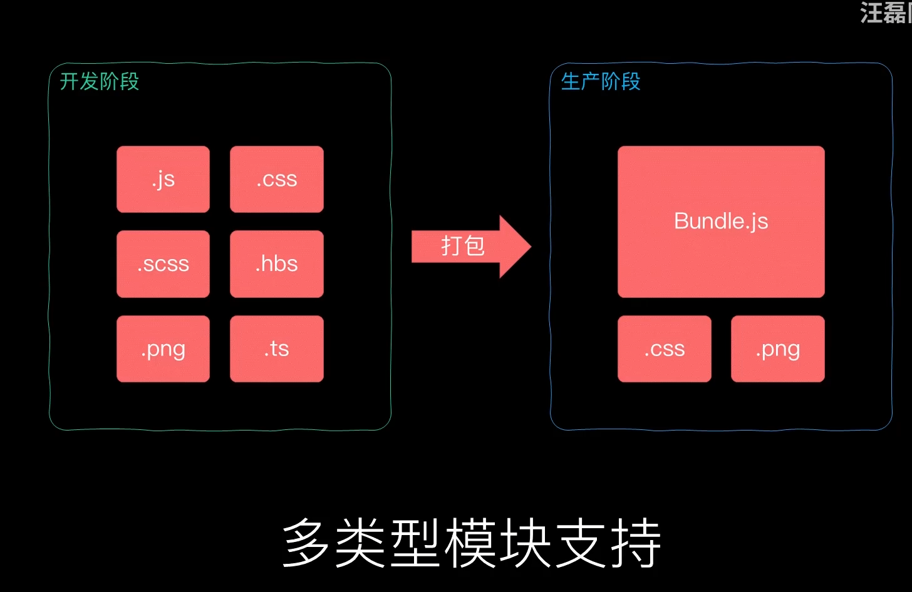
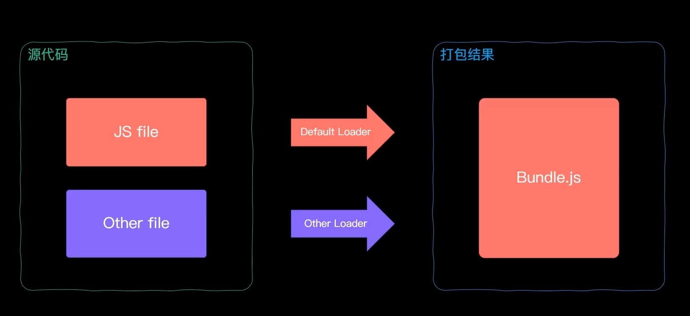
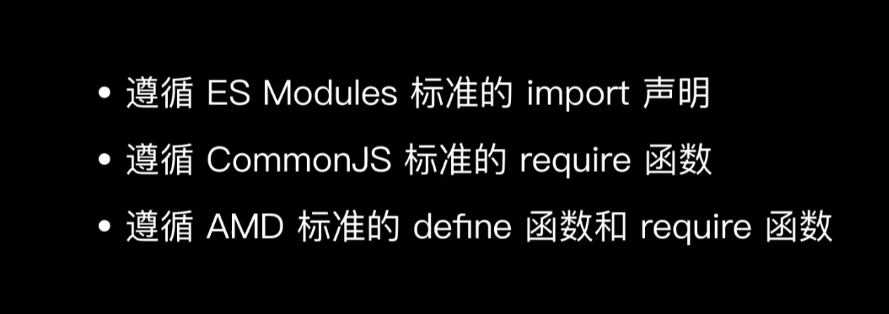
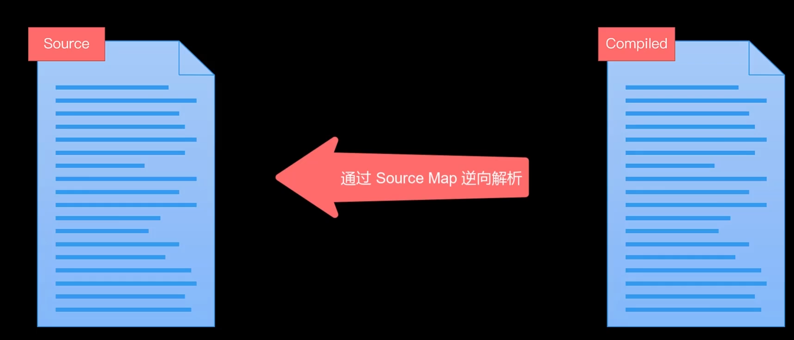

# webpack

commonJs、es-module，adm

[概念 | webpack 中文文档 | webpack中文文档 | webpack中文网 (webpackjs.com)](https://www.webpackjs.com/concepts/)

[Concepts | webpack](https://webpack.js.org/concepts/)

## features
```html
    <!-- es module标准 -->
    <script type="module">
        const foo = 'xxx';
        console.log('foo');
    </script>
    <!-- esm自动采用严格模式 -->
    <script type="module">
        console.log(this)        
    </script>
    <!-- 每个es都在私有作用域 -->
    <script type="module">
        console.log(foo, 'foo is undefined')
    </script>
    <!-- esm是通过cors方式获取外部js模块 -->
    <script type="module" src="https://xxx/"></script>
    <!-- esm的script, (优先脚本执行)标签会延迟执行 -->

```

## import & export
```js
import: 
1. 原生规范必须完整文件名引入模块
2. import('./xxx').then(function(module)){
    console.log(module);
}
导入promise对象。并看在任意位置使用
3. import xxx from modulePath 置于最顶层（{}不具有解构的含义）

export：
1. export { default as Name } from './default.js'
如果default.js 导入默认模块
```

## esm&cmj
```js

es-module.mjs:
// ES module 可导入 CommonJs 模块
// esm导入cmd，默认导出
import mod from './commonjs.js'
console.log(mod);

commonjs.js:
// CommonJs 始终只会导出一个默认成员
// module.exports = {
//     foo: 'commonjs'
// }
exports.foo = 'commonjs'
// node环境下，不能讲esm导入cmd

```

## bundle



Module Bundle => Loader => Code Splitting => Asset Module



## Loader

前端模块化核心

加载任意资源

1. 编译转换类
2. 文件操作类
3. 代码检查类




## plugin

```js
class MyPlugin{
  apply(compiler){
    console.log(compiler, 'go');
    compiler.hooks.emit.tap('MyPlugin', compilation => {
      for(const name in compilation.assets){
        // 输出打包内容
        // console.log(compilation.assets[name].source())
        if(name.endsWith('.js')){
          const contents = compilation.assets[name].source()
          const withoutComments = contents.replace(/\/\*\*+\*\//g, '')
          compilation.assets[name]={
            source: () => withoutComments,
            size: ()=>withoutComments.length
          }
        }
      }
    })
  }
}

plugins: [
    new CleanWebpackPlugin(),
    // 生成index.html
    new HtmlWebpackPlugin({
      title: 'Relimia',
      // meta标签配置
      meta: {
        viewport: 'width-device-width'
      },
      template: './src/templates/index.html'
    }),
    // 生成about.html
    new HtmlWebpackPlugin({
      filename: 'about.html',
    }),
    new CopyWebpackPlugin({
      patterns: [
        { from: path.join(__dirname, 'public'), to: 'public/' }
      ]
    }),
    new MyPlugin()
  ]
```

## webpack watch

webpack --watch

## auto-refresh tagPage

1. browsersync: [Browsersync - 省时的浏览器同步测试工具 | Browsersync 中文文档 (bootcss.com)](https://browsersync.bootcss.com/#install)

2. webpack dev server

   打包结果->存入内存,不直接读写dist

## webpack-dev-server

```js
npm i webpack-dev-server // 需要webpack-cli

// package.json配置
"dev-server": "webpack serve"

// webpack.config.js 配置静态文件路径:
devServer: {
    // 启动dev-server时导入
    static: {
      directory: './public'
    }
  },
```

## source-map

解决打包后 调试问题(打包压缩代码与开发代码不一致)




打包文件结尾 => 浏览器会自动解析

<table><thead><tr><th>devtool</th><th>performance</th><th>production</th><th>quality</th><th>comment</th></tr></thead><tbody><tr><td data-th="devtool"><span>(none)</span></td><td data-th="performance"><span><strong>build</strong>: fastest<br><br><strong>rebuild</strong>: fastest</span></td><td data-th="production"><span>yes</span></td><td data-th="quality"><span>bundle</span></td><td data-th="comment"><span>Recommended choice for production builds with maximum performance.</span></td></tr><tr><td data-th="devtool"><span><strong><code>eval</code></strong></span></td><td data-th="performance"><span><strong>build</strong>: fast<br><br><strong>rebuild</strong>: fastest</span></td><td data-th="production"><span>no</span></td><td data-th="quality"><span>generated</span></td><td data-th="comment"><span>Recommended choice for development builds with maximum performance.</span></td></tr><tr><td data-th="devtool"><span><code>eval-cheap-source-map</code></span></td><td data-th="performance"><span><strong>build</strong>: ok<br><br><strong>rebuild</strong>: fast</span></td><td data-th="production"><span>no</span></td><td data-th="quality"><span>transformed</span></td><td data-th="comment"><span>Tradeoff choice for development builds.</span></td></tr><tr><td data-th="devtool"><span><code>eval-cheap-module-source-map</code></span></td><td data-th="performance"><span><strong>build</strong>: slow<br><br><strong>rebuild</strong>: fast</span></td><td data-th="production"><span>no</span></td><td data-th="quality"><span>original lines</span></td><td data-th="comment"><span>Tradeoff choice for development builds.</span></td></tr><tr><td data-th="devtool"><span><strong><code>eval-source-map</code></strong></span></td><td data-th="performance"><span><strong>build</strong>: slowest<br><br><strong>rebuild</strong>: ok</span></td><td data-th="production"><span>no</span></td><td data-th="quality"><span>original</span></td><td data-th="comment"><span>Recommended choice for development builds with high quality SourceMaps.</span></td></tr><tr><td data-th="devtool"><span><code>cheap-source-map</code></span></td><td data-th="performance"><span><strong>build</strong>: ok<br><br><strong>rebuild</strong>: slow</span></td><td data-th="production"><span>no</span></td><td data-th="quality"><span>transformed</span></td><td></td></tr><tr><td data-th="devtool"><span><code>cheap-module-source-map</code></span></td><td data-th="performance"><span><strong>build</strong>: slow<br><br><strong>rebuild</strong>: slow</span></td><td data-th="production"><span>no</span></td><td data-th="quality"><span>original lines</span></td><td></td></tr><tr><td data-th="devtool"><span><strong><code>source-map</code></strong></span></td><td data-th="performance"><span><strong>build</strong>: slowest<br><br><strong>rebuild</strong>: slowest</span></td><td data-th="production"><span>yes</span></td><td data-th="quality"><span>original</span></td><td data-th="comment"><span>Recommended choice for production builds with high quality SourceMaps.</span></td></tr><tr><td data-th="devtool"><span><code>inline-cheap-source-map</code></span></td><td data-th="performance"><span><strong>build</strong>: ok<br><br><strong>rebuild</strong>: slow</span></td><td data-th="production"><span>no</span></td><td data-th="quality"><span>transformed</span></td><td></td></tr><tr><td data-th="devtool"><span><code>inline-cheap-module-source-map</code></span></td><td data-th="performance"><span><strong>build</strong>: slow<br><br><strong>rebuild</strong>: slow</span></td><td data-th="production"><span>no</span></td><td data-th="quality"><span>original lines</span></td><td></td></tr><tr><td data-th="devtool"><span><code>inline-source-map</code></span></td><td data-th="performance"><span><strong>build</strong>: slowest<br><br><strong>rebuild</strong>: slowest</span></td><td data-th="production"><span>no</span></td><td data-th="quality"><span>original</span></td><td data-th="comment"><span>Possible choice when publishing a single file</span></td></tr><tr><td data-th="devtool"><span><code>eval-nosources-cheap-source-map</code></span></td><td data-th="performance"><span><strong>build</strong>: ok<br><br><strong>rebuild</strong>: fast</span></td><td data-th="production"><span>no</span></td><td data-th="quality"><span>transformed</span></td><td data-th="comment"><span>source code not included</span></td></tr><tr><td data-th="devtool"><span><code>eval-nosources-cheap-module-source-map</code></span></td><td data-th="performance"><span><strong>build</strong>: slow<br><br><strong>rebuild</strong>: fast</span></td><td data-th="production"><span>no</span></td><td data-th="quality"><span>original lines</span></td><td data-th="comment"><span>source code not included</span></td></tr><tr><td data-th="devtool"><span><code>eval-nosources-source-map</code></span></td><td data-th="performance"><span><strong>build</strong>: slowest<br><br><strong>rebuild</strong>: ok</span></td><td data-th="production"><span>no</span></td><td data-th="quality"><span>original</span></td><td data-th="comment"><span>source code not included</span></td></tr><tr><td data-th="devtool"><span><code>inline-nosources-cheap-source-map</code></span></td><td data-th="performance"><span><strong>build</strong>: ok<br><br><strong>rebuild</strong>: slow</span></td><td data-th="production"><span>no</span></td><td data-th="quality"><span>transformed</span></td><td data-th="comment"><span>source code not included</span></td></tr><tr><td data-th="devtool"><span><code>inline-nosources-cheap-module-source-map</code></span></td><td data-th="performance"><span><strong>build</strong>: slow<br><br><strong>rebuild</strong>: slow</span></td><td data-th="production"><span>no</span></td><td data-th="quality"><span>original lines</span></td><td data-th="comment"><span>source code not included</span></td></tr><tr><td data-th="devtool"><span><code>inline-nosources-source-map</code></span></td><td data-th="performance"><span><strong>build</strong>: slowest<br><br><strong>rebuild</strong>: slowest</span></td><td data-th="production"><span>no</span></td><td data-th="quality"><span>original</span></td><td data-th="comment"><span>source code not included</span></td></tr><tr><td data-th="devtool"><span><code>nosources-cheap-source-map</code></span></td><td data-th="performance"><span><strong>build</strong>: ok<br><br><strong>rebuild</strong>: slow</span></td><td data-th="production"><span>no</span></td><td data-th="quality"><span>transformed</span></td><td data-th="comment"><span>source code not included</span></td></tr><tr><td data-th="devtool"><span><code>nosources-cheap-module-source-map</code></span></td><td data-th="performance"><span><strong>build</strong>: slow<br><br><strong>rebuild</strong>: slow</span></td><td data-th="production"><span>no</span></td><td data-th="quality"><span>original lines</span></td><td data-th="comment"><span>source code not included</span></td></tr><tr><td data-th="devtool"><span><code>nosources-source-map</code></span></td><td data-th="performance"><span><strong>build</strong>: slowest<br><br><strong>rebuild</strong>: slowest</span></td><td data-th="production"><span>yes</span></td><td data-th="quality"><span>original</span></td><td data-th="comment"><span>source code not included</span></td></tr><tr><td data-th="devtool"><span><code>hidden-nosources-cheap-source-map</code></span></td><td data-th="performance"><span><strong>build</strong>: ok<br><br><strong>rebuild</strong>: slow</span></td><td data-th="production"><span>no</span></td><td data-th="quality"><span>transformed</span></td><td data-th="comment"><span>no reference, source code not included</span></td></tr><tr><td data-th="devtool"><span><code>hidden-nosources-cheap-module-source-map</code></span></td><td data-th="performance"><span><strong>build</strong>: slow<br><br><strong>rebuild</strong>: slow</span></td><td data-th="production"><span>no</span></td><td data-th="quality"><span>original lines</span></td><td data-th="comment"><span>no reference, source code not included</span></td></tr><tr><td data-th="devtool"><span><code>hidden-nosources-source-map</code></span></td><td data-th="performance"><span><strong>build</strong>: slowest<br><br><strong>rebuild</strong>: slowest</span></td><td data-th="production"><span>yes</span></td><td data-th="quality"><span>original</span></td><td data-th="comment"><span>no reference, source code not included</span></td></tr><tr><td data-th="devtool"><span><code>hidden-cheap-source-map</code></span></td><td data-th="performance"><span><strong>build</strong>: ok<br><br><strong>rebuild</strong>: slow</span></td><td data-th="production"><span>no</span></td><td data-th="quality"><span>transformed</span></td><td data-th="comment"><span>no reference</span></td></tr><tr><td data-th="devtool"><span><code>hidden-cheap-module-source-map</code></span></td><td data-th="performance"><span><strong>build</strong>: slow<br><br><strong>rebuild</strong>: slow</span></td><td data-th="production"><span>no</span></td><td data-th="quality"><span>original lines</span></td><td data-th="comment"><span>no reference</span></td></tr><tr><td data-th="devtool"><span><code>hidden-source-map</code></span></td><td data-th="performance"><span><strong>build</strong>: slowest<br><br><strong>rebuild</strong>: slowest</span></td><td data-th="production"><span>yes</span></td><td data-th="quality"><span>original</span></td><td data-th="comment"><span>no reference. Possible choice when using SourceMap only for error reporting purposes.</span></td></tr></tbody></table>

### eval

eval('xxx'), 运行字符串xxx(虚拟机引擎)


开发模式:


生产环境:none(除非全民公测)


## Hot Module Replacement

(模块热更新/热替换)

解决auto-refresh时整个页面刷新

.js代码需要手动hmr

webpack5自动hotonly(相比webpack4)

## mode

不同环境使用不同配置

```js
// node环境下，使用cmj, 4 <= 版本零配置启动
const path = require('path')
const { CleanWebpackPlugin } = require('clean-webpack-plugin')
const webpack = require('webpack')
const HtmlWebpackPlugin = require('html-webpack-plugin');
const CopyWebpackPlugin = require('copy-webpack-plugin')

module.exports = (env, argv) => {
  const config = {
    // 这个属性有三种取值，分别是 production、development 和 none。
    // 1. 生产模式下，Webpack 会自动优化打包结果；
    // 2. 开发模式下，Webpack 会自动优化打包速度，添加一些调试过程中的辅助；
    // 3. None 模式下，Webpack 就是运行最原始的打包，不做任何额外处理；
    mode: 'none',
    entry: './src/main.js',   // 入口
    output: {                 // 输出
      filename: 'bundle.js',
      path: path.join(__dirname, 'dist'),
      // 指定公共文件资源路径（不然默认路径是 domain/）, 也可在loader上配置路径
      // publicPath: 'dist/'
    },
    devtool: 'eval-cheap-module-source-map',
    devServer: {
      // 启动dev-server时导入
      static: {
        directory: './public'
      },
      // 代理服务器
      proxy: {
        '/api': {
          // http://localhost:8080/api/users -> https://api.github.com/api/users
          target: 'https://api.github.com',
          pathRewrite: {
            '^/api': ''  // 斜线开头被替换成空
          },
          // 不能使用localhost:8080作为github的主机名 
          changeOrigin: true
        }
      },
      hot: true
      // hotonly:true
    },
    module: {
      rules: [
        {
          // 从后往前使用loader
          test: /.css$/,
          use: [{
            loader: 'style-loader'
          },
          {
            loader: 'css-loader',
            options: { esModule: false }
          }
          ]
        },
        {
          test: /\.(png|jpg|gif)$/,
          use: {
            loader: 'url-loader',
            options: {
              // 限制10kb，如果超过，使用file-loader
              limit: 10 * 1024,
              name: 'assets/[name].[ext]'
            }
          },
          type: 'javascript/auto'
          // use: 'url-loader'
          // 小文件可用Data Urls，减少请求次数，直接=>bundle
          // 大文件单独存放，加快加载时间
        },
        {
          test: /\.(htm|html)$/i,
          use: {
            loader: 'html-loader',
            options: {
              esModule: false,
              sources: {
                list: [
                  {
                    tag: 'a',
                    attribute: 'href',
                    type: 'src',
                  },
                  {
                    tag: 'img',
                    attribute: 'src',
                    type: 'src',
                  }
                ]
              }
            }
          }
        },
        {
          test: /\.svg$/,
          use: {
            loader: 'svg-url-loader'
          }
        },
        {
          test: /\.md$/,
          use: [
            'html-loader',
            './markdown-loader.js'
          ]
        }
      ]
    },
    plugins: [
      new HtmlWebpackPlugin({
        title: 'Relimia',
        meta: {
          viewport: 'width-device-width'
        },
        template: './src/templates/index.html'
      }),
    ]
  }
  if (env.production) {
    config.mode = 'production'
    config.devtool = false
    config.plugins = [
      ...config.plugins,
      new CleanWebpackPlugin(),
      new CopyWebpackPlugin({
        patterns: [
          { from: path.join(__dirname, 'public'), to: 'public/' }
        ]
      }),

    ]
  }
  return config
}
```

使用不同文件适配不同环境

## webpack.DefinePlugin

## tree shaking

## Code Splitting

分包

- 多入口
- 动态导入

## Magic Comments

## Mini-Css-Extract, optimize-css-assets-webpack-plugin

## hash、chunkhash、contenthash


## 总结

常见webpack打包优化

### 性能优化 - 代码分离

将代码分离到不同的bundle中，之后我们可以按需加载，或者并行加载这些文件；

默认情况下，所有的JavaScript代码（业务代码、第三方依赖、暂时没有用到的模块）在首页全部都加载，就会影响首页 的加载速度；

分出更小的bundle，以及控制资源加载优先级，提供代码的加载性能；

#### 入口起点优化

1. 配置entry

2. 多入口，entry => Dependencies ，入口依赖

   ```js
   module.export = {
       ...
       entey: {
           index: {
               import: './src/index.js',
               dependOn: 'shared'
           },
           main: {
               import: './src/main.js',
               dependOn: 'shared'
           },
           shared: ['axios'] // => shared-bundle.js
       }
       ...
   }
   ```

#### 动态导入(dynamice import)

es的import() 

使用魔法注释

```js
function xxx(){
    import(/* webpackChunkName: "main" */'./router/main')
}


// 动态导出文件名：webpack
chunkFilename: '[name]_chunk.js'
```

#### 自定义分包 - SplitChunks

（webpack默认集成SplitChunksPlugin）

默认配置中，chunks仅仅针对于异步（async）请求

1. 默认，chunks仅针对动态加载模块，async
2. inital/all时，会遵循splickChunks配置

```js
1. minSize：
拆分包的大小, 至少为minSize；
如果一个包拆分出来达不到minSize,那么这个包就不会拆分；

2. minSize：
拆分包的大小, 至少为minSize；
如果一个包拆分出来达不到minSize,那么这个包就不会拆分；

3. cacheGroups：
用于对拆分的包就行分组，比如一个lodash在拆分之后，并不会立即打包，而是会等到有没有其他符合规则的包一起来打包；
test属性：匹配符合规则的包；
name属性：拆分包的name属性；
filename属性：拆分包的名称，可以自己使用placeholder属性；

cacheGroups:{
    utils: {
        test: /utils/,
        filename: "[id]_utils.js"
    },
	vendors:{
        test: /[\\/]node_modules[\\/]/,
        filename: "[id]_vendors.js"
    }    
}
```

optimization:

- optimization.chunkIds配置
  optimization.chunkIds配置用于告知webpack模块的id采用什么算法生成
  开发过程中，推荐使用named；
  打包过程中，推荐使用deterministic；(确定性的，在不同的编译中不变的短数字id)
- optimization.runtimeChunk配置
  配置runtime相关的代码是否抽取到一个单独的chunk中：
  runtime相关的代码指的是在运行环境中，对模块进行解析、加载、模块信息相关的代码；
  比如我们的component、bar两个通过import函数相关的代码加载，就是通过runtime代码完成的；
  抽离出来后，有利于浏览器缓存的策略：
  比如我们修改了业务代码（main），那么runtime和component、bar的chunk是不需要重新加载的；
  比如我们修改了component、bar的代码，那么main中的代码是不需要重新加载的；
  设置的值：
  true/multiple：针对每个入口打包一个runtime文件；
  single：打包一个runtime文件；
  对象：name属性决定runtimeChunk的名称；
  ``runtimeChunk: {name: "runtime"}``


**Prefetch和Preload**

- prefetch(预获取)：将来某些导航下可能需要的资源
- preload(预加载)：当前导航下可能需要资源

=> use magic comment：/* webpackPrefetch: true */

### CDN

CDN称之为内容分发网络（Content Delivery Network或Content Distribution Network，缩写：CDN）， 它是指通过相互连接的网络系统，利用最靠近每个用户的服务器； 更快、更可靠地将音乐、图片、视频、应用程序及其他文件发送给用户； 来提供高性能、可扩展性及低成本的网络内容传递给用户；

- 在开发中，我们使用CDN主要是两种方式：
  - 方式一：打包的所有静态资源，放到CDN服务器， 用户所有资源都是通过CDN服务器加载的；
  - 方式二：一些第三方资源放到CDN服务器上；


1. ``output.publicPath: 'https:xxx'`` （配置cdn server）
2. `script.src = 'https:xxx'`，通过第三方cdn，引入资源，并在`externals:{key:"value"}`排除包

### 提取css文件

MiniCssExtractPlugin 插件可以提取css文件

> 注意：1.**style-loader**打包样式是放到标签内联上的，2. **minicssExtractPlugin**打包独立css文件然后link标签引入css。

### 性能优化-打包文件命名(Hash,ContentHash,ChunkHash)

1. Hash:

   hash本身是通过MD4的散列函数处理后，生成一个128位的hash值（32个十六进制）；

   hash值的生成和整个项目有关系，(一个文件一改，其它文件都改)

2. ChunkHash

   根据不同的入口进行借来解析来生成hash值

   比如我们修改了index.js，那么main.js的chunkhash是不会发生改变的；

3. ContentHash

   成的文件hash名称，只和内容有关系

   比如我们的index.js，引入了一个style.css，style.css有被抽取到一个独立的css文件中；

   这个css文件在命名时，如果我们使用的是chunkhash；

   那么当index.js文件的内容发生变化时，css文件的命名也会发生变化；

   这个时候我们可以使用contenthash；
   
   > 推荐使用**contenthash**，可以让没改动的文件文件名一样，然后用户浏览器还能使用以前的缓存文件

   

### 性能优化-JS-CSS代码压缩

#### JS

Terser是一个JavaScript的解释（Parser）、Mangler（绞肉机）/Compressor（压缩机）的工具集；

`npm i terser -g/-D`

在webpack中有一个minimizer属性，在**production**模式下，默认就是使用**TerserPlugin**来处理

如果对默认的配置不满意，也可以创建**TerserPlugin**的实例，并且覆盖相关的配置；

**首先，我们需要打开minimize，让其对我们的代码进行压缩（默认production模式下已经打开了）**

其次，**我们可以在minimizer创建一个TerserPlugin：**

- extractComments：默认值为true，表示会将注释抽取到一个单独的文件中；
  - 在开发中，我们不希望保留这个注释时，可以设置为false；
- parallel：使用多进程并发运行提高构建的速度，默认值是true
  - 并发运行的默认数量： os.cpus().length - 1；
  - 我们也可以设置自己的个数，但是使用默认值即可；
- terserOptions：设置我们的terser相关的配置
  - compress：设置压缩相关的选项；
  - mangle：设置丑化相关的选项，可以直接设置为true；
  - toplevel：顶层变量是否进行转换；
  - keep_classnames：保留类的名称；
  - keep_fnames：保留函数的名称；

#### CSS

**npm install css-minimizer-webpack-plugin -D**

optimization.minimizer中配置

### 性能优化-webpack实现Tree Shaking

- Tree Shaking是一个术语，在计算机中表示消除死代码（dead_code）；
- 最早的想法起源于LISP，用于消除未调用的代码（纯函数无副作用，可以放心的消除，这也是为什么要求我们在进行函数式 编程时，尽量使用纯函数的原因之一）；

Tree Shaking是源自打包工具rollup

这是因为Tree Shaking依赖于ES Module的静态语法分析（不执行任何的代码，可以明确知道模块的依赖关系）；

webpack4扩展该能力：可在package.json 的 sideEffects标记

webpack5，对comJS支持tree shaking

#### JS

**usedExports:**

- **usedExports：通过标记某些函数是否被使用，之后通过Terser来进行优化的；**
- **sideEffects**：**跳过整个模块/文件，直接查看该文件是否有副作用**；

将mode设置为development模式：

- 为了可以看到 usedExports带来的效果，我们需要设置为 development 模式

设置usedExports为true和false对比打包后的代码：

- 在usedExports设置为true时，会有一段注释：**unused harmony export mul；**
- **告知Terser在优化时，可以删除掉这段代码；**

 当minimize设置true：usedExports设置为true时，mul函数有被移除掉；


**sideEffects**

sideEffects用于告知webpack compiler哪些模块时有副作用的：

- 副作用的意思是这里面的代码有执行一些特殊的任务，不能仅仅通过export来判断这段代码的意义；

- 在package.json中设置sideEffects的值：
  - 如果我们将sideEffects设置为false，就是告知webpack可以安全的删除未用到的exports；
  - 如果有一些我们希望保留，可以设置为数组；

在项目中对JavaScript的代码进行TreeShaking呢（生成环境）？（项目中最佳实践）

- **在optimization中配置usedExports为true，来帮助Terser进行优化；**
- **在package.json中配置sideEffects，直接对模块进行优化；**

#### CSS

**npm install purgecss-webpack-plugin -D**

- paths：表示要检测哪些目录下的内容需要被分析，这里我们可以使用glob；
- 默认情况下，Purgecss会将我们的html标签的样式移除掉，如果我们希望保留，可以添加一个safelist的属性；

```js
// webpack
plugins: [
    new PurgeCSSPlugin({
        pahts: glob.sync(`${path.resolve(__dirname, '../src')}/**/*`, {nodir: true}),
        safelist: function(){
            return {
                // 不需要treeShaking的类名
                standard: ["body"]
            }
        }
    })
]
```

### Scope Hoisting(作用域提升）

### 性能优化-Webpack对文件压缩

HTTP压缩

HTTP压缩是一种内置在 服务器 和 客户端 之间的，以改进传输速度和带宽利用率的方式；

- 第一步：HTTP数据在服务器发送前就已经被压缩了；（可以在webpack中完成）
- 第二步：兼容的浏览器在向服务器发送请求时，会告知服务器自己支持哪些压缩格式；
- 第三步：服务器在浏览器支持的压缩格式下，直接返回对应的压缩后的文件，并且在响应头中告知浏览器；


目前的压缩格式非常的多：

compress – UNIX的“compress”程序的方法（历史性原因，不推荐大多数应用使用，应该使用gzip或deflate）；

deflate – 基于deflate算法（定义于RFC 1951）的压缩，使用zlib数据格式封装；

**gzip – GNU zip格式（定义于RFC 1952），是目前使用比较广泛的压缩算法；**

br – 一种新的开源压缩算法，专为HTTP内容的编码而设计；


webpack中相当于是实现了HTTP压缩的第一步操作，我们可以使用CompressionPlugin。

- **npm install compression-webpack-plugin -D**

```js
// webpack
plugins: [
    new CompressionPlugin({
        test: /\.(js|css)$/,
        algorithm: 'gzip'
    })
]
```

### 性能优化-HTML代码压缩

HtmlWebpackPlugin插件来生成HTML的模板，事实上它还有一些其他的配置：

inject：设置打包的资源插入的位置

- true、 false 、body、head

cache：设置为true，只有当文件改变时，才会生成新的文件（默认值也是true）

minify：默认会使用一个插件html-minifier-terser

```js
plugins: [
    new HtmlWebpackPlugin({
        template: './index.html',
        cache: true,
        minify: isProduction?{
            removeComments: true,
            removeEmptyAttributes: true,
            removeRedundantAttributes: true,
            collapseWhitespace: true,
            // 要缩内联样式
            minifyCSS: true,
            minifyJs:{
                mangle:{
                    toplevel: true
                }
            }
        }: false
    })
]
```

[webpack性能优化方案(详细) - 掘金 (juejin.cn)](https://juejin.cn/post/7233298696292040741#heading-20)
