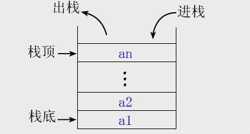
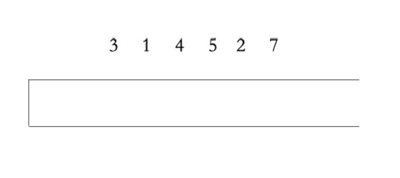
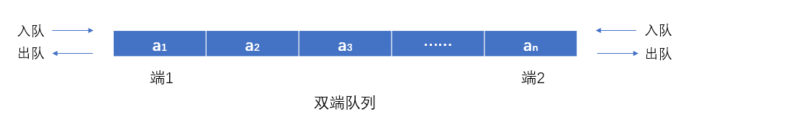
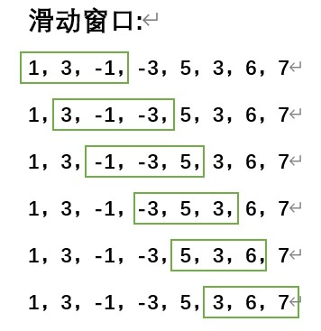
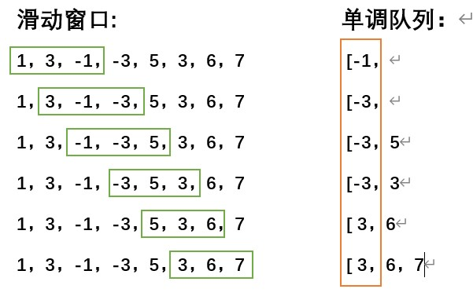
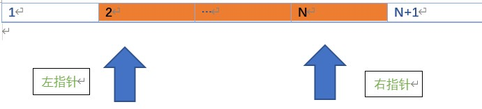

***“如果一个选手比你小还比你强，你就可以退役了。”**——（著名的（bushi））单调队列原理*（咳咳，假的，瞎编的（氵，求生欲满满））

**前言**

本文将简单介绍三种比较有用，也比较简单的技巧。可以通过这三种技巧使得许多问题能有较好程度的优化。


## 单调栈

### 简述

**栈**，一种后进先出的线性数据结构。




**单调栈**，顾名思义，即具有单调性的栈结构。

在将新元素入栈的过程中，为了维护栈的单调性，我们会对已在栈元素采取**出栈**（pop()）方式，使得**新元素入栈后能继续单调**。

如该图所示：

构造个**单调递增**的单调栈。

将要入栈的元素：3，1，4，5，2，7。



1. 第一个元素入栈：[3 ,

2. 第二个元素入栈：[1，（因为栈顶元素3大于1，不满足单调递增这样的单调性，故出栈。）

3. 第三，四个元素入栈：[1，4，5，

4. 第五个元素入栈：[1，2，（原因同步骤2）

5. 第六个元素入栈：[1，2，7，。

6. 结束。

   

**在维护单调递增的栈的时，不难发现，栈顶元素始终是栈内元素中最大的。同理，在维护单调递减的栈时，栈顶元素也肯定是栈内元素最小的。**而我们在各类问题的应用中，就是应用这一性质。

**模板代码如下：**

```cpp
//利用C++提供的stl模板库<stack>(本人比较习惯用这个)
//一个单调递减的单调栈
stack<int> sta;
...
//当栈为空时，无条件入栈，若新元素大于栈顶元素，则出栈栈顶元素。
while(!sta.empty() && sta.top()<x)
    sta.pop()
sta.push(x)
...
```

```cpp
//若对C++提供<stack>的操作不熟悉，可以参考下面代码。
int _stack[maxn];
int pi = 0;//可以看作一个指针（pointer），含义为栈顶位置以及栈元素个数
for (int i = 0; i < the_number_of_element;i++){
    while(pi&&_stack[pi-1]<element[i]){
        pi--;
    }
    _stack[pi++] = element[i];
}
```

由于每个元素最多入栈一次且最多出栈一次，所以复杂度是线性的。

### 例题应用：[luogu p5788](https://www.luogu.com.cn/problem/P5788)

**题意：**

给出项数为 n 的整数数列 a~1~ ... a~n~。

定义函数 f(i) 代表数列中**第 i 项之后第一个大于 a~i~ 的项a~j~的下标j**，即 f(i)=min ~i<j<=n,aj>ai~ {j}。若不存在，则 f(i)=0。

试求出 f(1 ... n)。

**数据范围：1 <= n <= 3 * 10^6^,1<= a~i~ <= 10^9^**

**示例：**

输入：

```
5
1 4 3 2 5
```

输出：

```
2 5 5 5 0
```

**分析：**

**一.**

 如果是单纯的暴力去遍历第i个后面的每个元素，则算法的时间复杂度将会是O(n^^^2)。在这道题中，n最大可为3*10^6^，无法在**一秒**内跑完这最糟糕的情况。并且在这查询过程中有太多的重复和没必要的步骤了，于是我们采用**单调栈来优化查询过程**。

**二.** 

构造一个**单调递减的栈**：

**步骤：**

如果栈顶元素的值 *ai*  >= 当前遍历到的元素*aj*，则**编号*j***入栈

当栈顶元素的值 *ai*  < 当前遍历到的元素 *aj* ，则找到第一个大于*ai*的元素，则*j*为*f(i)*。

**因为能让*ai*出栈的一定是大于*ai*的元素**。

例如：

对于上诉示例：5，[1,4,3,2,5]

1. 第一个元素入栈：[1，

2. 第二个元素（值：a2=4）入栈：[2，

    **由于栈顶元素的值 a1 < a2，所以栈顶出栈**，此时 **f(1)=2**;

3. 第三个元素（值：a3=3）入栈：[2，3，

4. 第四个元素（值：a4=2）入栈：[2，3，4，

5. 第五个元素（值：a5=5）入栈：[5，

   **由于 a4 < a5，所以4出栈，f(4)=5；,同理2，3依次入栈，故f(3)=5，f(2)=5;**

7. 遍历结束。由于5仍在栈内，即说明（无敌是多么滴寂寞），不存在aj > a5 (j>5)，所以f(5) = 0。

**结果：2，5，5，5，0为所求。**

**参考代码**：

```cpp
#include <bits/stdc++.h>
using namespace std;

const int maxn=3e6+3;
int an[maxn];
int ans[maxn];

void solve(){
    int n;
    cin >> n;
    memset(ans,0,sizeof ans);
    for (int i = 0; i < n;i++)
    {
        cin >> an[i];
    }
    stack<int> st;
    for (int i = 0; i < n;i++){
        if(st.size()==0||an[st.top()-1]>=an[i]){
            st.push(i+1);//一个单调递减的单调栈，这里压入栈的是该元素对应的位置
        }
        else {
            while(st.size()!=0&&an[st.top()-1]<an[i])
            {
                ans[st.top() - 1] = i + 1;//说明找到了最近的大于栈顶的数。
                st.pop();
            }
        }
        st.push(i+1);
    }
    for (int i = 0; i < n;i++){
        cout << ans[i] << ' ';
    }
}

int main()
{
    int t=1;
    while(t--)
    {
        solve();
    }
    return 0;
}
```


## 单调队列

### 简述

一般来说的队列，就是一种先进先出的数据结构。


不过为维护单调队列的单调性，这里我们使用的是双端队列（deque）。

双端队列，支持下列操作：

1. 队首入队，队首出队
2. 队尾入队，队尾出队
3. 返回队首、队尾值

   ......



单调队列通常用于解决**滑动窗口**这类区间问题。例如**在长度为 n 的数组中，要求每个长度为 m 的区间的最值问题**。这个问题也可以采用ST表或线段树，时间复杂度为O(nlogn)；而采用单调队列的程序时间复杂度优化为O(n)  ，从效率上更优。

#### **维护单调性**

1. 在有新元素要入队时，为维护队列元素值单调性，可以将队尾元素出队（**这步与单调栈无异**）。

2. 对于不满足**某一条件**的队首元素，出队（例如由于窗口的滑动，使得队首元素脱离窗口等；**与单调栈的区别**）

#### **模板代码：**

```cpp
//使用C++stl库中的头文件<deque>
deque<int> Q;
for (int i = 0; i < n; ++i)
{
    if (!Q.empty() && i - Q.front() >= m) 
        Q.pop_front();//队首出队
    while (!Q.empty() && V[Q.back()] < V[i])//出队 
        Q.pop_back();//队尾出队
    Q.push_back(i); //(这里进去的是编号)
}
```

```cpp
//同样，顺便给出用数组模拟双端队列的模板。
int _deque[maxn];
int pi_back = 0, pi_from = 0;//队首指针，队尾指针；采用双指针。
for (int i = 0; i < n;i++){
    if((pi_back-pi_front)!=0&&i-_deque[pi_front]>m){
        pi_front++;
    }
    while(pi_back-pi_front!=0&&v[_deque[pi_back-1]]<v[i])
        pi_back--;
    _deque[pi_back++] = i;//进去的是编号
}
```

接下来先看道题。

### 例题应用：（纯纯滴）**滑动窗口**(来源：[**luogu p1886**](https://www.luogu.com.cn/problem/P1886))

**题意：**

有一个长为 **n** 的序列 **a**，以及一个大小为 **k** 的窗口。现在这个从左边开始向右滑动，每次滑动一个单位，求出每次滑动后窗口中的最大值和最小值。

示例：

输入

```
8 3
1 3 -1 -3 5 3 6 7
```

输出

```
-1 -3 -3 -3 3 3
3 3 5 5 6 7
```

（如下图所示，绿色框框为）



#### **分析：**

（1）若采用暴力的方式枚举出每个窗口，然后再依次遍历每个区间，依次找到最大、最小值。则时间复杂度将达到O((n-k)*k)。最糟糕的情况下能有O(n^2^)。相对来说还是比较糟糕的。

```cpp
vector<int> ans_min,ans_max;
for(int i=0;i+k<n;i++){
    int min_=num[i],max_=num[i];
    for(int j=i;j<k+i;j++){
        if(min_>num[j])min_=num[j];
        if(max_<num[j])max_=num[j];
    }
    ans_min.push_back(min_);
    ans_max.push_back(max_);
}
```


（2）于是我们采用**单调队列来进行优化**，时间复杂度为O(n)：

不妨先考虑**最小值**的情况：

**原理：**构造**每个窗口的  <u>单调递增</u>  的单调队列**，在维护单调性过程中，单调队列的队首一定是该窗口的最小值（**问就是它是单调递增的队列**）

**例如样例：**

8 3
1 3 -1 -3 5 3 6 7



1.第一个滑动窗口**[1,3,-1]**：将元素入队并维护单调性：[-1，

   队首为-1，**<u>最小值为-1</u>**。

**2.向右滑动一格，**[3,-1,-3]，由于窗口前两个元素均已在被操作过，**使用步骤一的单调队列**，将新元素入队并维护：[-3，

  队首为-3，**<u>最小值为-3</u>**

3.向右滑动一格，[-1,-3,5,]，将5入队后得队列：[-3，5，

  队首为-3，**<u>最小值为-3</u>**

4.向右滑动，[-3,5,3]，维护单调性并入队：[-3，3，

  队首为-3，**<u>最小值为-3</u>**

**5.向右滑动，**[5,3,6]:继续延用步骤4的单调队列，**因为队首元素-3已经不再滑动窗口里了**，所以**队列队首元素出列**:[3，将新元素6入队：[3，6，

队首为3，**<u>最小值为3</u>**。

6.向右滑动，[3,6,7]。7入队，[3，6，7，

队首为3，**<u>最小值为3</u>**。

综上：-1 -3 -3 -3 3 3 为所求结果。

**同理，求最大值的情况则构造个单调递减的队列。**

参考代码：

```cpp
#include <bits/stdc++.h>
using namespace std;

vector<int> v;
int n, k;
void solve(){
    cin >> n >> k;
    for (int i = 0; i < n;i++){
        int a;
        cin>>a;
        v.push_back(a);
    }
    deque<int> q1, q2;
    vector<int> ans1, ans2;
    for (int i = 0; i < n;i++){
        if(!q1.empty()&&i-q1.front()>=k){
            q1.pop_front();//队首出队
        }
        while(!q1.empty()&&v[i]<v[q1.back()]){
            q1.pop_back();//队尾出队
        }
        q1.push_back(i);
        ans1.push_back(v[q1.front()]);
        
        if(!q2.empty()&&i-q2.front()>=k){
            q2.pop_front();
        }
        while(!q2.empty()&&v[i]>v[q2.back()]){
            q2.pop_back();
        }
        q2.push_back(i);
        ans2.push_back(v[q2.front()]);
    }
    for (int i = k - 1; i < n;i++)
        cout << ans1[i] << ' ';
    cout << endl;
    for (int i = k - 1; i < n;i++)
        cout << ans2[i] << ' ';
    cout << endl;
    
    v.clear();
}

int main()
{
    ios::sync_with_stdio(false);
    int t=1;
    //cin >> t;
    while(t--)
    {
        solve();
    }
    system("pause");
    return 0;
}
```

### 例外：

**单调队列优化dp**：

单调队列有时也常用于动态规划（DP）算法中：

例如一个状态转移方程：**dp[i] = min ~l<=j<=r~ {dp[j]} + c**

（其中j属于区间[l，r]；c为某一常量）。

这时如果题目对时间限制要求苛刻的话，可以考虑运用单调队列进行**优化查找**。构造一个在这个区间（区间可能随着状态转移而改变）内的**单调递增单调队列**。这样，**队首元素一定是区间内最小值**，只要返回队首元素的值则**min ~l<=j<=r~ {dp[j]}**就可以被立马找到了。

详细可以参考**luogu p5858**的这个问题。

**注：**单调队列适用于**滑动窗口**问题，但对于**任意长度任意位置**的区间所进行的问题，是不适应的，可以考虑用**ST表**或**线段树**等算法来有效解决。

### 

## 双指针

### 简述

双指针法是一种简单而又灵活的技巧和思想，单独使用可以轻松解决一些特定问题，和其他算法结合也能发挥多样的用处，有时也被叫做尺取法。

顾名思义，双指针法，就是采用两个“指针“：left_pointer(左指针)，right_pointer(右指针)。



通过某种条件对区间增广或缩小，以此获得想要结果。

不同问题下，两个指针的增长速度和起点方向均是可以不一样的。

伪代码如下：

```cpp
int left_pointer,right_pointer;
while(left_pointer<right_pointer){
    ...
    if(...)
        right_pointer++;//扩大区间,[l,r] -> [l,r+1]
    if(...)
        left_pointer++;//缩小区间, [l,r] -> [l+1,r]
}
```

### 例题应用：

**题意：**

某个数n可以表示成连续的数的平方和，求出有多少种这样的表示方法。

求表示方法按连续数的个数递减排列。

输入：一个数n。

输出：第一个数为符合题意的一个连续递增排列的个数，再输出排列。

数据范围：1 <= n<= 10^14^

**示例：**

```
2030
```

```
2
4 21 22 23 24
3 25 26 27
```

即：21^2^ + 22^2^ + 23^2^ + 24^2^ = 2030

**题解：**是道纯纯的双指针模板题。

不妨先声明两个指针l，r；

并且声明一个变量sum；为区间[l-1,r]平方和之和。

及
$$
sum = \sum_{i=l-1}^{r}{i^2}
$$

- 当sum<n时，右指针+1，即区间变为[l-1,r+1]，sum += (r+1)^2^。
- 当sum>n时，左指针+1，即区间变为[l,r]，sum -= (l-1)^2^。
- 当sum==n时，记录这段区间。
- 当r<l时，结束循环。

```cpp
#include <iostream>
#include<vector>
using namespace std;

void solve(){
    long long l=1, r=1;
    long long n;
    cin >> n;
    long long sum = 1;
    int cnt = 0;
    vector<long long> ans;
    while(l<=r){
        if(n==sum){
            cnt++;//符合条件的区间个数
            ans.push_back(r-l+1);//区间长度
            for (int i = l; i <= r; i++)
            {
                ans.push_back(i);
            }
        }
        if(n>=sum){
            r++;
            sum += r * r;
        }
        else if(n<sum){
            sum -= l * l;
            l++;
        }
    }
    cout << cnt << endl;
    for (int i = 0; i < ans.size();i++){
        cout << ans[i]<<' ';
        long long len = ans[i];
        for (int j = 0; j < len;j++,i++){
            cout << ans[i+1] << ' ';
        }
        cout << endl;
    }
}

int main()
{
    solve();
    system("pause");
    return 0;
}
```

### 


## 题单

| 题目(来源)                                                   | 算法标签           | 难度                     |
| ------------------------------------------------------------ | ------------------ | ------------------------ |
| [**luogu p5788**](https://www.luogu.com.cn/problem/P5788)    | 单调栈             | ⭐**（模板题）**          |
| [**luogu p1901**](https://www.luogu.com.cn/problem/P1901)    | 单调栈             | ⭐                        |
| [**luogu p7399**](https://www.luogu.com.cn/problem/P7399)    | 单调栈             | ⭐⭐                       |
| [**luogu p1823**](https://www.luogu.com.cn/problem/P1823)    | 单调栈             | ⭐⭐                       |
| [**poj 2559**](http://poj.org/problem?id=2559)               | 单调栈             | ⭐⭐(**最小矩形问题**，典) |
| [**codeforce 1407d**](https://codeforces.com/contest/1407/problem/D) | dp、单调栈         | ⭐⭐⭐                      |
| [**codeforce 1313c2**](https://codeforces.com/contest/1313/problem/C2) | dp、单调栈         | ⭐⭐⭐                      |
| [**luogu p1886**](https://www.luogu.com.cn/problem/P1886)    | 单调队列           | ⭐（模板题）              |
| [**luogu p1714**](https://www.luogu.com.cn/problem/P1714)    | 单调队列，前缀和   | ⭐⭐                       |
| [**luogu p2629**](https://www.luogu.com.cn/problem/P2629)    | 单调队列，前缀和   | ⭐⭐                       |
| **[HDU 3415](https://vjudge.net/problem/HDU-3415)**          | 单调队列，前缀和   | ⭐⭐                       |
| [**luogu p2216**](https://www.luogu.com.cn/problem/P2216)    | 单调队列           | ⭐⭐                       |
| [**luogu p5858**](https://www.luogu.com.cn/problem/P5858)    | 单调队列，dp       | ⭐⭐                       |
| [**luogu p2034**](https://www.luogu.com.cn/problem/P2034)    | 单调队列，dp       | ⭐⭐⭐                      |
| [**luogu p3957**](https://www.luogu.com.cn/problem/P3957)    | 单调队列，dp，二分 | ⭐⭐⭐                      |
| [**poj 2100**](http://poj.org/problem?id=2100)               | 双指针             | ⭐                        |
| [**HDU 5178**](https://vjudge.net/problem/HDU-5178)          | 双指针，二分       | ⭐                        |
| [**HDU 5672**](https://vjudge.net/problem/HDU-5672)          | 双指针             | ⭐                        |
| [**luogu p1381**](https://www.luogu.com.cn/problem/P1381)    | 双指针             | ⭐                        |
| [**luogu p3143**](https://www.luogu.com.cn/problem/P3143)    | 双指针             | ⭐⭐                       |
| [**HDU 1937**](https://vjudge.net/problem/HDU-1937)          | 双指针，前缀和     | ⭐⭐                       |
| [**HDU 5358**](https://vjudge.net/problem/HDU-5358)          | 双指针，前缀和     | ⭐⭐                       |
